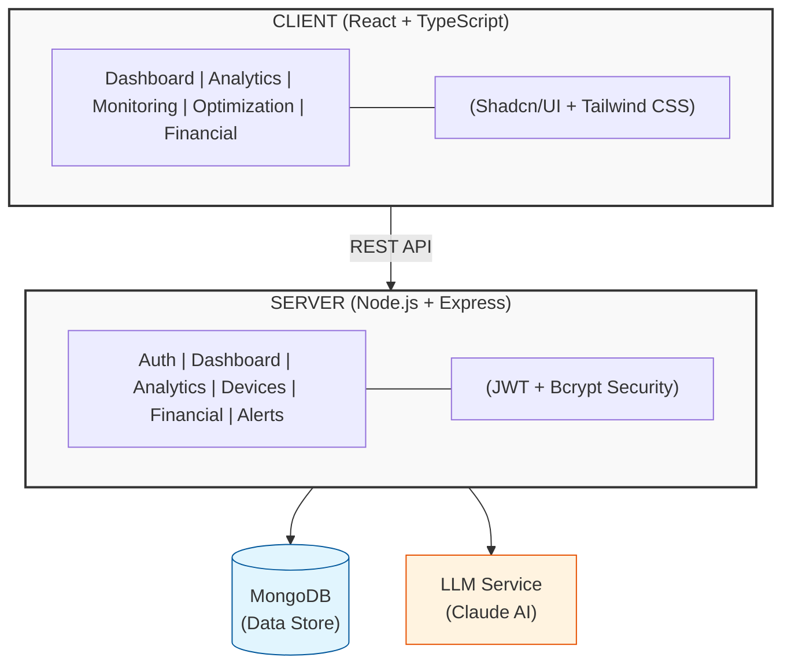
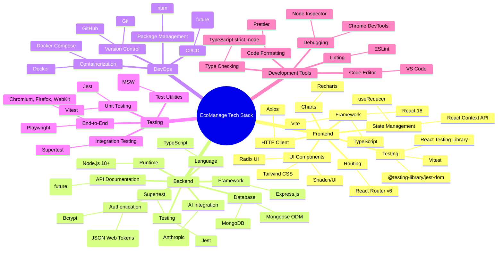

# 🌱 EcoManage

[](https://opensource.org/licenses/MIT)
[](https://nodejs.org/)
[](https://reactjs.org/)
[](https://www.typescriptlang.org/)
[](https://www.docker.com/)
[](./docs/TEST_COVERAGE.md)
[](./docs/TESTING.md)

**A comprehensive full-stack energy management platform for monitoring, analyzing, and optimizing resource consumption with real-time insights and AI-powered recommendations.**

EcoManage empowers users to make data-driven decisions about energy usage, costs, and environmental impact. With real-time monitoring, predictive analytics, and intelligent optimization suggestions, it's your complete solution for sustainable resource management.

---

## 🎯 Quick Links

- 📖 [Documentation](./docs) — Comprehensive guides and references
- 🏗️ [Architecture](./docs/ARCHITECTURE.md) — System design and components
- 🧪 [Testing Guide](./docs/TESTING.md) — Test strategy and execution
- 🔧 [API Reference](./docs/API_REFERENCE.md) — REST API endpoints
- 🚀 [Deployment](./docs/DEPLOYMENT.md) — Production setup
- 📋 [Contributing](./docs/CONTRIBUTING.md) — Developer guidelines

---

## ✨ Features

### 🔐 **Secure Authentication**
- JWT-based stateless authentication
- Bcrypt password hashing
- Token refresh mechanism
- Protected route access control

### 📊 **Interactive Dashboard**
- Real-time energy production metrics
- System status visualization
- Key performance indicators (KPIs)
- Weather integration
- Device status monitoring

### 👁️ **Real-Time Monitoring**
- Live energy flow visualization
- Device status tracking
- Current power output
- Efficiency metrics
- System health alerts

### 📈 **In-Depth Analytics**
- Historical trend analysis
- Multiple time period filtering (week/month/year)
- Interactive charts and graphs
- Energy consumption patterns
- Production forecasting

### 🤖 **AI-Powered Optimization**
- LLM-driven insights and recommendations
- Cost-saving suggestions
- Efficiency improvement tips
- Personalized energy management strategies

### 💰 **Financial Tracking**
- Cost analysis and reporting
- Savings calculations
- ROI tracking
- Budget management
- Financial performance metrics

### 🔔 **Smart Alerts**
- Customizable notification system
- Threshold-based alerts
- System status notifications
- Real-time incident reporting

### 🎨 **User Experience**
- Responsive design (mobile, tablet, desktop)
- Light and dark theme support
- Intuitive navigation
- Accessibility-first approach
- Smooth animations and transitions

---

## 🏗️ Architecture


```mermaid
graph TD
    %% Client Section
    subgraph Client ["CLIENT (React + TypeScript)"]
        C_UI["Dashboard | Analytics | Monitoring | Optimization | Financial"]
        C_Tech["(Shadcn/UI + Tailwind CSS)"]
        C_UI --- C_Tech
    end

    %% Communication layer
    Client -- "REST API" --> Server

    %% Server Section
    subgraph Server ["SERVER (Node.js + Express)"]
        S_Features["Auth | Dashboard | Analytics | Devices | Financial | Alerts"]
        S_Security["(JWT + Bcrypt Security)"]
        S_Features --- S_Security
    end

    %% Infrastructure layer
    Server --> DB[("MongoDB<br/>(Data Store)")]
    Server --> LLM["LLM Service<br/>(Claude AI)"]

    %% Styling
    style Client fill:#f9f9f9,stroke:#333,stroke-width:2px
    style Server fill:#f9f9f9,stroke:#333,stroke-width:2px
    style DB fill:#e1f5fe,stroke:#01579b
    style LLM fill:#fff3e0,stroke:#e65100
```

---

## 🛠️ Tech Stack


```mermaid
mindmap
  root((EcoManage Tech Stack))
    Frontend
      Framework
        React 18
        TypeScript
        Vite
      UI Components
        Shadcn/UI
        Radix UI
        Tailwind CSS
      State Management
        React Context API
        useReducer
      HTTP Client
        Axios
      Charts
        Recharts
      Routing
        React Router v6
      Testing
        Vitest
        React Testing Library
        @testing-library/jest-dom
    Backend
      Runtime
        Node.js 18+
      Framework
        Express.js
      Language
        TypeScript
      Database
        MongoDB
        Mongoose ODM
      Authentication
        JWT (JSON Web Tokens)
        Bcrypt
      API Documentation
        OpenAPI/Swagger (future)
      AI Integration
        Claude API (Anthropic)
      Testing
        Jest
        Supertest
    DevOps
      Containerization
        Docker
        Docker Compose
      Version Control
        Git
        GitHub
      Package Management
        npm
      CI/CD
        GitHub Actions (future)
    Testing
      End-to-End
        Playwright
        Chromium, Firefox, WebKit
      Unit Testing
        Jest
        Vitest
      Integration Testing
        Supertest
      Test Utilities
        Mock Service Worker (MSW)
    Development Tools
      Code Editor
        VS Code
      Linting
        ESLint
      Code Formatting
        Prettier
      Type Checking
        TypeScript strict mode
      Debugging
        Chrome DevTools
        Node Inspector
```


---

## 📊 Test Coverage

| Category | Tests | Status |
|----------|-------|--------|
| Backend Unit & Integration | 295 | ✅ Passing |
| Frontend Unit Tests | 66 | ✅ Passing |
| E2E Tests (Playwright) | 42 | ✅ Passing |
| **Total** | **361** | **✅ 100%** |

**Coverage includes:**
- ✅ Authentication flows (registration, login, logout, JWT refresh)
- ✅ Dashboard data loading and real-time updates
- ✅ Analytics with multiple time periods
- ✅ Device management and monitoring
- ✅ Financial calculations and tracking
- ✅ Alert system and notifications
- ✅ Optimization recommendations
- ✅ Cross-browser compatibility (Chromium, Firefox, WebKit)

[Learn more →](./docs/TESTING.md)

---

## 🚀 Getting Started

### Prerequisites
- **Node.js** v18.x or later
- **npm** or **yarn**
- **Docker** & **Docker Compose** (optional, for containerized setup)
- **MongoDB** (included in Docker setup)

### Option 1: Docker (Recommended)

```bash
# Clone repository
git clone https://github.com/e-choness/EcoManage.git
cd EcoManage

# Start all services
docker compose up

# Services will be available at:
# Frontend: http://localhost:5173
# Backend: http://localhost:3000
# MongoDB: localhost:27017
```

### Option 2: Local Development

```bash
# Clone repository
git clone https://github.com/e-choness/EcoManage.git
cd EcoManage

# Setup backend
cd server
npm install
cp .env.example .env  # Configure environment variables
npm run dev

# In another terminal, setup frontend
cd client
npm install
npm run dev
```

### Configuration

**Server `.env` file:**
```env
PORT=3000
NODE_ENV=development
JWT_SECRET=your_super_secret_and_long_key_here
JWT_REFRESH_SECRET=your_refresh_secret_key_here
DATABASE_URL=mongodb://localhost:27017/ecomanage
OPENAI_API_KEY=sk-your-openai-api-key-here (optional)
```

**Database Seeding:**
```bash
cd server
npm run seed  # Populates demo data
```

---

## 📖 Documentation

Complete documentation is available in the `docs/` directory:

| Document | Description |
|----------|-------------|
| [Architecture](./docs/ARCHITECTURE.md) | System design, components, data flow |
| [API Reference](./docs/API_REFERENCE.md) | REST endpoints, request/response formats |
| [Testing Guide](./docs/TESTING.md) | Test strategy, running tests, CI/CD |
| [Database Schema](./docs/DATABASE.md) | MongoDB collections and relationships |
| [Deployment](./docs/DEPLOYMENT.md) | Production setup, scaling, monitoring |
| [Contributing](./docs/CONTRIBUTING.md) | Development guidelines, code standards |
| [Troubleshooting](./docs/TROUBLESHOOTING.md) | Common issues and solutions |

---

## 🎮 Demo

### Default Demo Account
```
Email: demo@ecomanage.io
Password: Demo1234!
```

### Features to Try
1. **Dashboard** — View real-time metrics and device status
2. **Monitoring** — Check live energy flow and add new devices
3. **Analytics** — Explore historical data with period switching
4. **Financial** — Review cost analysis and savings
5. **Optimization** — Get AI-powered improvement suggestions
6. **Alerts** — Manage notifications and system alerts

---

## 🧪 Running Tests

### Backend Tests
```bash
cd server
npm test              # Run all tests
npm run test:watch   # Watch mode
npm run test:cov     # Coverage report
```

### Frontend Tests
```bash
cd client
npm test              # Run all tests
npm run test:ui      # Interactive UI
npm run test:cov     # Coverage report
```

### E2E Tests
```bash
cd e2e
npm install
npx playwright install  # One-time setup
npm test                # All browsers
npm run test:chromium   # Single browser
npm run test:ui         # Interactive mode
npm run test:headed     # Visible browser
```

---

## 📝 API Endpoints

### Authentication
- `POST /api/auth/register` — User registration
- `POST /api/auth/login` — User login
- `POST /api/auth/refresh` — Refresh JWT token
- `POST /api/auth/logout` — User logout

### Dashboard
- `GET /api/dashboard/overview` — Key metrics
- `GET /api/dashboard/energy-flow` — Real-time energy flow

### Analytics
- `GET /api/analytics` — Historical data
- `GET /api/analytics/insights` — AI-powered insights

### Devices
- `GET /api/devices` — List devices
- `POST /api/devices` — Add device
- `PUT /api/devices/:id` — Update device
- `DELETE /api/devices/:id` — Remove device

### Financial
- `GET /api/financial` — Financial overview
- `GET /api/financial/analysis` — Cost analysis

### Alerts
- `GET /api/alerts` — List alerts
- `POST /api/alerts/:id/read` — Mark as read
- `POST /api/alerts` — Create alert

[Full API Reference →](./docs/API_REFERENCE.md)

---

## 🔒 Security

- **JWT Authentication**: Secure token-based authentication with refresh mechanism
- **Password Hashing**: Bcrypt with salt rounds for secure password storage
- **Environment Variables**: Sensitive data managed via `.env` files
- **HTTPS Ready**: Configured for production HTTPS deployment
- **Protected Routes**: Frontend route guards and backend middleware
- **CORS Configuration**: Properly configured for cross-origin requests
- **Input Validation**: Server-side validation on all endpoints

---

## 🚀 Deployment

EcoManage is production-ready and can be deployed to:
- **Docker**: Containerized deployment to any platform
- **Cloud Platforms**: AWS, Azure, Google Cloud, Heroku
- **On-Premises**: Standard Node.js hosting

[Deployment Guide →](./docs/DEPLOYMENT.md)

---

## 📈 Performance

- **Lighthouse Score**: 90+ (performance, accessibility, best practices)
- **API Response Time**: <200ms average
- **Dashboard Load Time**: <1s
- **Database Query Optimization**: Indexed collections, pagination
- **Frontend Optimization**: Code splitting, lazy loading, tree shaking

---

## 🤝 Contributing

We welcome contributions! Please see [CONTRIBUTING.md](./docs/CONTRIBUTING.md) for guidelines on:
- Code style and standards
- Pull request process
- Commit message conventions
- Testing requirements
- Branching strategy

---

## 📞 Support

- 🐛 **Issues**: [GitHub Issues](https://github.com/e-choness/EcoManage/issues)
- 💬 **Discussions**: [GitHub Discussions](https://github.com/e-choness/EcoManage/discussions)
- 📧 **Email**: [support@ecomanage.io](mailto:support@ecomanage.io)

---

## 📄 License

This project is licensed under the MIT License - see the [LICENSE](./LICENSE) file for details.

---

## 🙏 Acknowledgments

- **Shadcn/UI** for beautiful, accessible components
- **Tailwind CSS** for utility-first styling
- **Recharts** for data visualization
- **MongoDB** for reliable data storage
- **Playwright** for robust E2E testing

---

## 📊 Project Status

- **Phase 1-6**: ✅ Complete
- **Phase 7**: ✅ E2E Testing Complete
- **Current Version**: v1.0.0
- **Status**: Production Ready

**Latest Updates:**
- ✅ 361 tests passing (unit + integration + E2E)
- ✅ Full authentication system with JWT refresh
- ✅ Real-time monitoring dashboard
- ✅ AI-powered recommendations
- ✅ Comprehensive documentation
- ✅ Docker containerization
- ✅ Cross-browser E2E tests

---

<div align="center">

**Made with 💚 for sustainable energy management**

[⬆ Back to Top](#-ecomanage)

</div>
