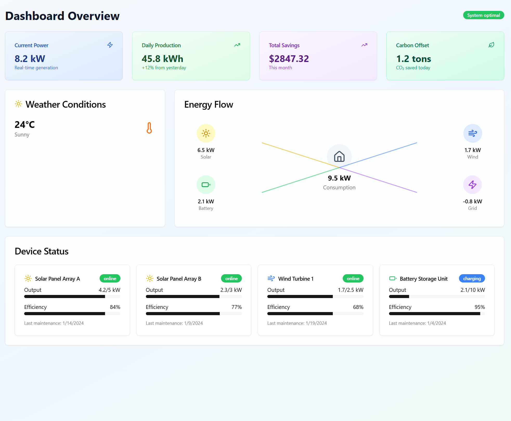
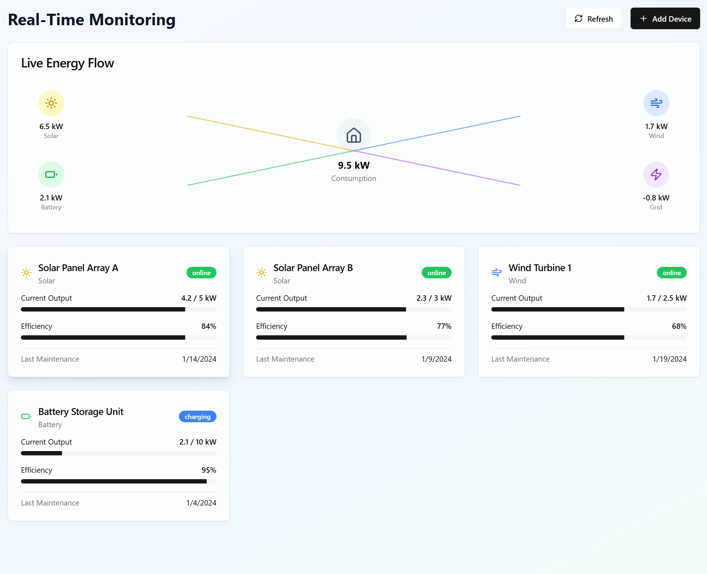
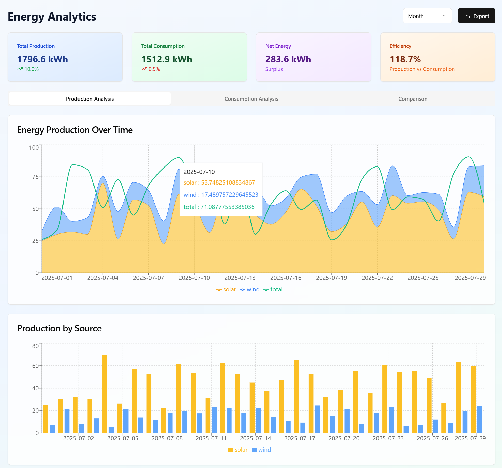
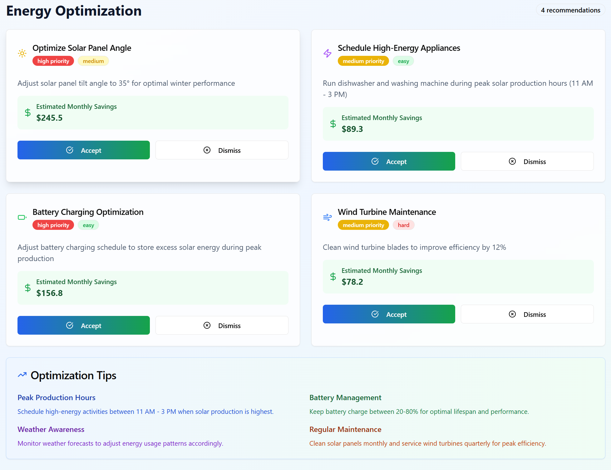
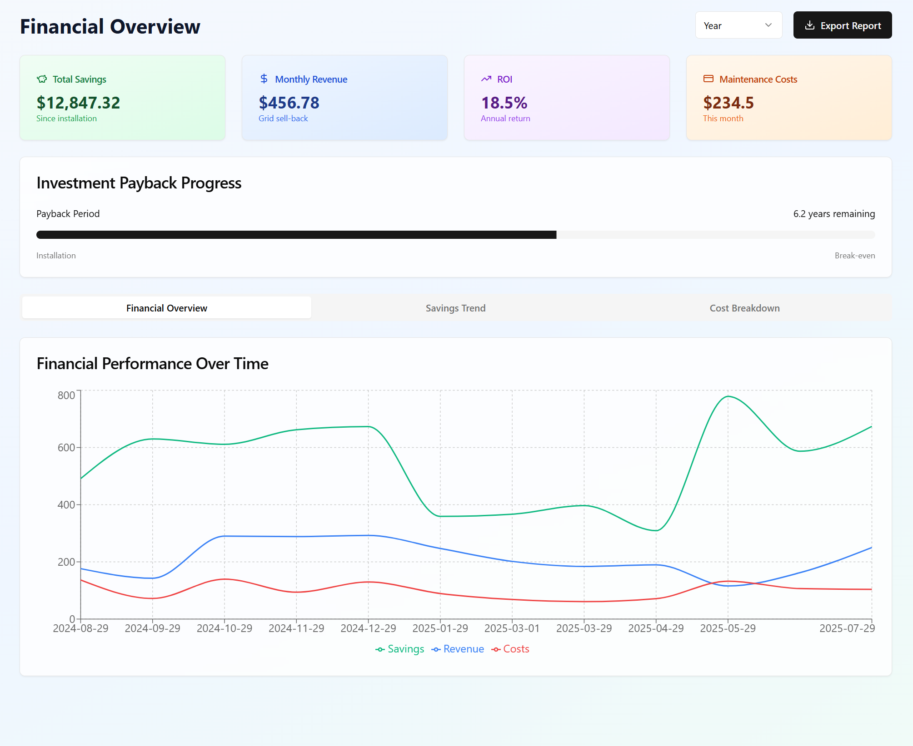

# 🌱 EcoManage

[](https://opensource.org/licenses/MIT)
[](https://nodejs.org/)
[](https://reactjs.org/)
[](https://www.typescriptlang.org/)
[](https://www.docker.com/)

**Energy monitoring for a single site: production, consumption, devices, alerts and costs.**


> **Status.** This is the v1 app after the v2 Phase 0 clean-up (bug fixes, security, monorepo
> layout). The v2 rebuild — sites and roles, MQTT telemetry, tariffs, approvals — follows the
> phased plan in the design handoff (`IMPLEMENTATION_PLAN.md`). Nothing from later phases exists
> yet, and this README only describes what does.

---

## Screens

|                     Overview                     |                          Monitoring                           |                        Analytics                         |                          Optimization                           |                         Financial                          |
| :----------------------------------------------: | :-----------------------------------------------------------: | :------------------------------------------------------: | :-------------------------------------------------------------: | :--------------------------------------------------------: |
|  |  |  |  |  |

## What it does

- **Dashboard**: current production, today's production vs the same time yesterday,
  month-to-date and 30-day totals, estimated savings and CO₂ avoided, system status, and energy
  flow (solar, wind, battery, consumption, grid import/export).
- **Monitoring**: devices (solar, wind, battery, grid meter) with status. Devices can be added in
  the UI; the API also supports editing and deleting them (the UI for that comes with P4-04).
- **Analytics**: daily production by source and daily consumption for a week, month or year.
- **Optimization**: recommendations you can accept or dismiss.
- **Alerts**: list, filter, mark as read. The header badge refreshes every 30 s.
- **Financial**: savings, revenue, costs, ROI and payback from monthly records.
- **Account**: register, sign in, profile and password.

All energy values are stored as hourly kWh readings. Day and month boundaries are UTC.

## Quick start (Docker)

Everything runs in containers; you only need Docker.

```bash
git clone https://github.com/e-choness/EcoManage.git
cd EcoManage
docker compose up -d
```

| Service   | URL / port              |
| --------- | ----------------------- |
| Web app   | http://localhost:5173   |
| API       | http://localhost:3000   |
| MongoDB   | localhost:27017         |
| Redis     | localhost:6379          |

`docker compose up` also runs `mongo-seed` once, which **resets** the demo accounts and a year of
hourly demo readings. Sign in with:

```
demo@ecomanage.io / Demo1234!
```

The API reads `apps/api/.env.example`, then `apps/api/.env` if it exists (gitignored), so a fresh
clone works with no setup. Put real secrets in `apps/api/.env`.

## Repository layout

```
apps/
  api/        Express + Mongoose API (modules/<name>/{routes,controller,service,model}.ts)
  web/        React 18 + Vite + Tailwind + shadcn/ui client
packages/     shared workspace packages (none yet; P1-02 adds packages/shared)
e2e/          Playwright suite (outdated, see bugs/003)
docs/         architecture, API, database, testing and ops notes
bugs/         issues found during the v2 work, for review
```

The repo is a pnpm workspace. Shared TypeScript settings live in `tsconfig.base.json` and lint
rules in the root `eslint.config.js`.

## Common commands

Run everything inside the dev container:

```bash
# all checks (integration tests need the mongodb service running)
docker compose run --rm api pnpm -r typecheck
docker compose run --rm api pnpm -r lint
docker compose run --rm api pnpm -r test
docker compose run --rm api pnpm -r build

# one package
docker compose run --rm api pnpm --filter @ecomanage/api test
docker compose run --rm api pnpm --filter @ecomanage/web test

# reseed the demo data
docker compose run --rm mongo-seed
```

After changing dependencies, refresh the lockfile, rebuild the image, and recreate the containers
with fresh `node_modules` volumes (`-V`). Otherwise the old volumes keep the old packages:

```bash
docker compose build
docker compose up -d --force-recreate -V api web
```

The old npm entry points still work from the root as aliases: `pnpm server`, `pnpm client`,
`pnpm start`.

## Security

- The access token is kept in memory in the browser. The refresh token is an httpOnly,
  `SameSite=Strict` cookie scoped to `/api/auth`, rotated on every refresh and revoked on logout.
- CORS only allows origins listed in `CORS_ORIGINS`. `helmet` sets security headers.
- Rate limits are 300 requests/min per IP on `/api` and 10/min on login, register and refresh,
  stored in Redis so they hold across API instances.
- Request logs record method, path, status and duration only. Credentials are redacted.
- No `.env` file has ever been committed (checked across all history in P0-02).

## Documentation

| Document                                      | Contents                                        |
| --------------------------------------------- | ----------------------------------------------- |
| [Architecture](./docs/ARCHITECTURE.md)         | Layers, request flow, auth, tech stack          |
| [API reference](./docs/API_REFERENCE.md)       | Every endpoint with request and response shapes |
| [Database](./docs/DATABASE.md)                 | Collections, fields and indexes                 |
| [Testing](./docs/TESTING.md)                   | Test suites and how to run them                 |
| [Deployment](./docs/DEPLOYMENT.md)             | Configuration and what production needs         |
| [Contributing](./docs/CONTRIBUTING.md)         | Branches, commits, code rules                   |
| [Troubleshooting](./docs/TROUBLESHOOTING.md)   | Known problems and fixes                        |

## License

MIT, see [LICENSE](./LICENSE).
