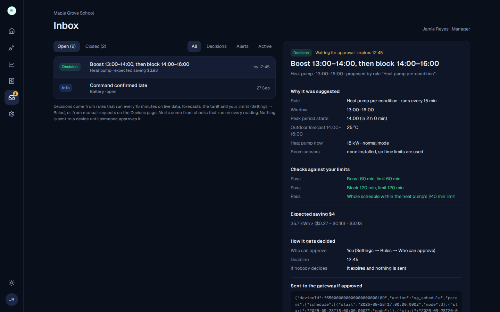
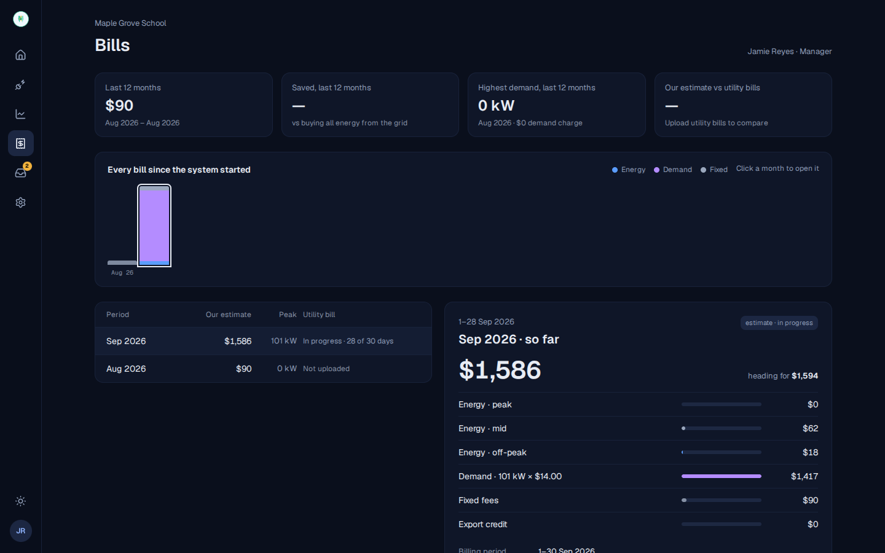
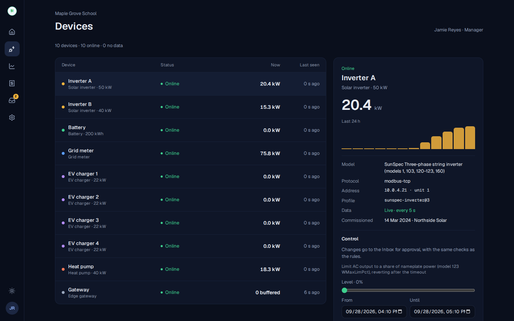
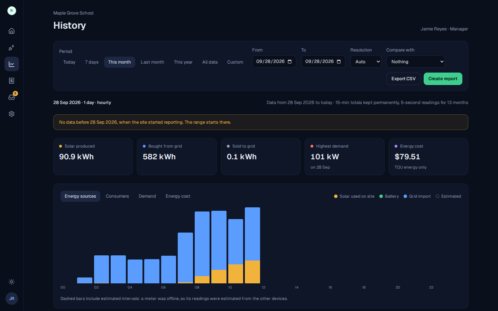
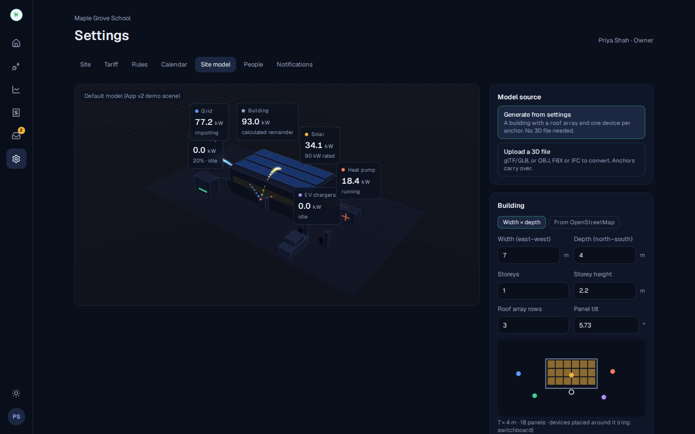
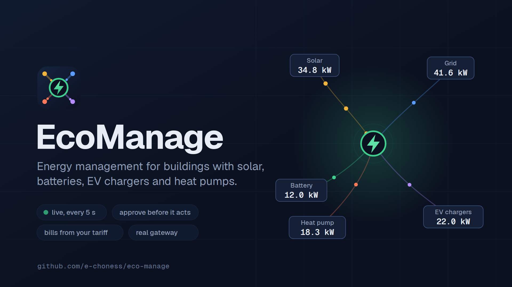
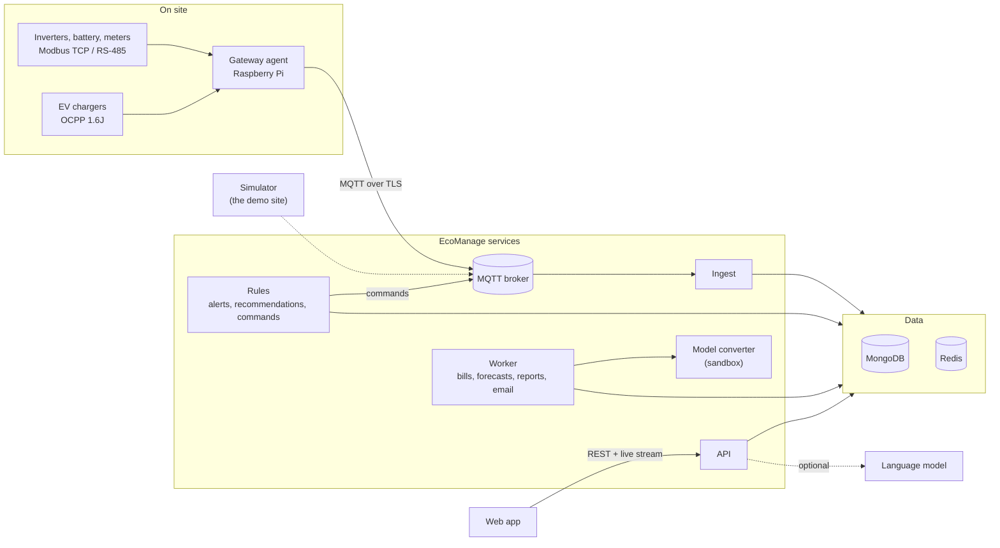

<div align="center">

<a href="https://e-choness.github.io/eco-manage/">
  
</a>

<p>
  <a href="https://github.com/e-choness/eco-manage/actions/workflows/ci.yml"></a>
  <a href="https://github.com/e-choness/eco-manage/actions/workflows/docs.yml"></a>
  <a href="https://github.com/e-choness/eco-manage/commits/main"></a>
  <a href="https://github.com/e-choness/eco-manage/pulse"></a>
  <a href="https://github.com/e-choness/eco-manage/pulls"></a>
  
  <a href="./LICENSE"></a>
</p>
<p>
  
  
  
  
  
  
  
  
</p>

**Energy management for real buildings.** Solar, batteries, EV chargers and heat pumps on one live
view, bills from the site's own tariff, and changes that only reach a device once someone approves them.

[**Documentation**](https://e-choness.github.io/eco-manage/) ·
[Getting started](https://e-choness.github.io/eco-manage/guide/getting-started) ·
[What it does](https://e-choness.github.io/eco-manage/guide/features) ·
[Changelog](./CHANGELOG.md)

</div>

<picture>
  <source media="(prefers-color-scheme: light)" srcset="docs/public/media/walkthrough-light.webp">
  
</picture>

## ✨ What it does

| | |
| --- | --- |
| ⚡ **Live site** | Power moving between solar, the battery, the grid, EV chargers, the heat pump and the building every 5 seconds, on a 3D model of the site; demand against the cap, the bill so far, today's prices. |
| 🧾 **Bills** | Time-of-use and demand tariffs with versions, the month so far and where it's heading, savings from solar and the battery, PDF statements, and the utility's bill compared with the estimate. |
| ✅ **Recommendations** | Peak shaving, EV off-peak charging, EV limits near the cap, heat-pump pre-conditioning, storm reserve and export caps, each with its checks and saving. Nothing is sent until someone approves; every result is measured the next day. |
| 💬 **Explanations** | Any recommendation explained in plain words by a language model: bring any OpenAI-compatible key or Anthropic's. Only the numbers are sent, never names. |
| 🔔 **Alerts** | Silent devices, low solar, battery below reserve, demand near the cap, failed commands; emails with escalation, remote fixes, and auto-resolve. |
| 📈 **History and reports** | Any range by hour, day or month, CSV exports, and scheduled PDF, CSV or Excel reports by email. |
| 🧊 **Site model** | Generated from the building's size or its OpenStreetMap outline, or uploaded as glTF, OBJ, FBX or IFC and converted in a sandbox. |
| 🔌 **Gateway** | A Raspberry Pi agent for Modbus TCP/RTU and OCPP 1.6J chargers with a 7-day offline buffer and safety limits on every command, claimed by QR code. |

<details>
<summary><b>More screenshots</b></summary>

| Inbox: a decision with its checks | Bills: the month so far |
| --- | --- |
|  |  |
| **Devices** | **History** |
|  |  |
| **Settings: the site model** | |
|  | |

</details>

<details>
<summary><b>Media kit</b></summary>

A 16:9 banner for slides, videos and link previews, in the same style as the banner above, and the
app icon. The SVGs are animated and follow light or dark mode; the PNGs are still frames.

<picture>
  <source media="(prefers-color-scheme: light)" srcset="docs/public/media/banner-16x9-light.png">
  
</picture>

| Asset | Files |
| --- | --- |
| Banner, 16:9 (1920×1080) | [SVG, animated](docs/public/media/banner-16x9.svg) · [PNG, dark](docs/public/media/banner-16x9.png) · [PNG, light](docs/public/media/banner-16x9-light.png) |
| Banner, wide (1200×380) | [SVG, animated](docs/public/hero.svg) |
| Icon | [SVG](apps/web/public/favicon.svg) · [SVG, animated](apps/web/public/logo.svg) · [PNG 512](apps/web/public/icon-512.png) · [PNG 180](apps/web/public/apple-touch-icon.png) |
| Walkthrough | [dark](docs/public/media/walkthrough-dark.webp) · [light](docs/public/media/walkthrough-light.webp) (animated WebP) |

</details>

## 🚀 Try it

Only Docker is needed:

```bash
git clone https://github.com/e-choness/eco-manage.git && cd eco-manage
docker compose up -d
docker compose run --rm mongo-seed      # demo accounts and site
```

Then open **http://localhost:5173** and sign in as `manager@ecomanage.io` with `Demo1234!`.
A simulated school (86 kWp of solar, a 200 kWh battery, four EV chargers and a heat pump) starts
feeding it straight away.

<details>
<summary><b>Demo accounts and local services</b></summary>

| Email | Role on Maple Grove School |
| --- | --- |
| `demo@ecomanage.io` | owner |
| `manager@ecomanage.io` | manager |
| `installer@ecomanage.io` | installer (until 31 Dec 2026) |

All use the password `Demo1234!`.

| Service | Address |
| --- | --- |
| Web app | http://localhost:5173 |
| API | http://localhost:3000 |
| Emails (Mailpit) | http://localhost:8025 |
| Simulator state | http://localhost:4100/sim/state |
| Documentation | `docker compose --profile docs up -d docs` → http://localhost:5174/eco-manage/ |

</details>

## 🏗️ How it fits together


```mermaid
flowchart LR
  subgraph site["On site"]
    dev["Inverters, battery, meters<br/>Modbus TCP / RS-485"] --> gw["Gateway agent<br/>Raspberry Pi"]
    ev["EV chargers<br/>OCPP 1.6J"] --> gw
  end
  sim["Simulator<br/>(the demo site)"]
  subgraph services["EcoManage services"]
    broker[("MQTT broker")]
    ingest["Ingest"]
    rules["Rules<br/>alerts, recommendations, commands"]
    worker["Worker<br/>bills, forecasts, reports, email"]
    api["API"]
    conv["Model converter<br/>(sandbox)"]
  end
  subgraph data["Data"]
    mongo[("MongoDB")]
    redis[("Redis")]
  end
  web["Web app"] -- "REST + live stream" --> api
  gw -- "MQTT over TLS" --> broker
  sim -.-> broker
  broker --> ingest
  rules -- "commands" --> broker
  ingest --> data
  rules --> data
  worker --> data
  api --> data
  worker --> conv
  api -. "optional" .-> llm["Language model"]
```

Everything runs as containers with Docker Compose; the [architecture](https://e-choness.github.io/eco-manage/ARCHITECTURE)
page walks through each service.

<details>
<summary><b>Repository layout</b></summary>

```text
apps/
  api/        REST API and the live stream (Express, Mongoose)
  web/        the web app (React 19, Vite 8, Tailwind 4, three.js)
  ingest/     MQTT → telemetry, latest values, 15-minute intervals, live events
  rules/      alerts, recommendations and command dispatch
  worker/     bills, savings, forecasts, reports, exports and email (BullMQ)
  simulator/  the demo site: a simulated gateway with weather, loads and faults
  gateway/    the edge agent for a Raspberry Pi: Modbus, OCPP, buffer, commands
  modelconv/  the sandboxed 3D model converter
packages/
  shared/     types, schemas, MQTT topics, tariff and billing maths, site time
  db/         the data model
  profiles/   device profiles: register maps, write limits, fixes
  recs/       the recommendation rules
docs/         the documentation site (VitePress)
infra/        compose file, broker config and certificates
e2e/          Playwright smoke and accessibility tests
```

</details>

<details>
<summary><b>Development</b></summary>

Every check runs inside the dev container; nothing is installed on the host.

```bash
docker compose exec api pnpm -r typecheck
docker compose exec api pnpm -r lint
docker compose exec api pnpm knip                     # unused files, exports, dependencies
docker compose exec api pnpm -r --workspace-concurrency=1 test
docker compose --profile e2e run --rm e2e             # Playwright against the running stack
```

CI runs the same commands in the same images on every pull request. See
[Testing](https://e-choness.github.io/eco-manage/TESTING) and
[Contributing](https://e-choness.github.io/eco-manage/CONTRIBUTING).

</details>

## 📚 Documentation

| | |
| --- | --- |
| [Getting started](https://e-choness.github.io/eco-manage/guide/getting-started) | Run it, sign in, what to try |
| [What it does](https://e-choness.github.io/eco-manage/guide/features) | Every page and what's behind it |
| [Architecture](https://e-choness.github.io/eco-manage/ARCHITECTURE) | Services, data flow, security |
| [API](https://e-choness.github.io/eco-manage/API_REFERENCE) | Every endpoint |
| [Gateway agent](https://e-choness.github.io/eco-manage/GATEWAY) | Claiming, setup on a Pi, bench checks |
| [Deployment](https://e-choness.github.io/eco-manage/DEPLOYMENT) | Configuration and what production needs |
| [Hosting a demo](https://e-choness.github.io/eco-manage/guide/demo-hosting) | Free options compared |
| [Changelog](./CHANGELOG.md) | What changed, release by release |

The same pages are in [`docs/`](./docs) in this repository.

## 📄 License

Proprietary. Copyright (c) 2025-2026 Echo (Beili) Yin. All rights reserved. No use, copying,
modification or distribution without written permission; see [LICENSE](./LICENSE).
