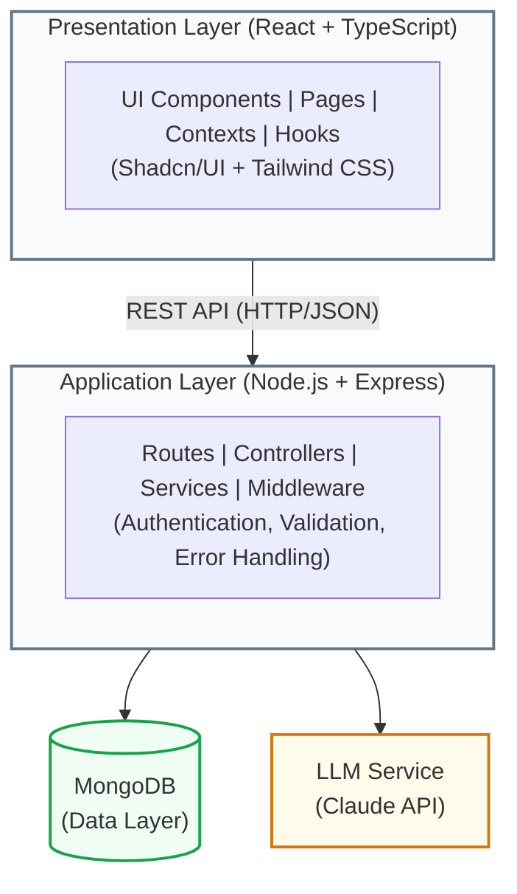
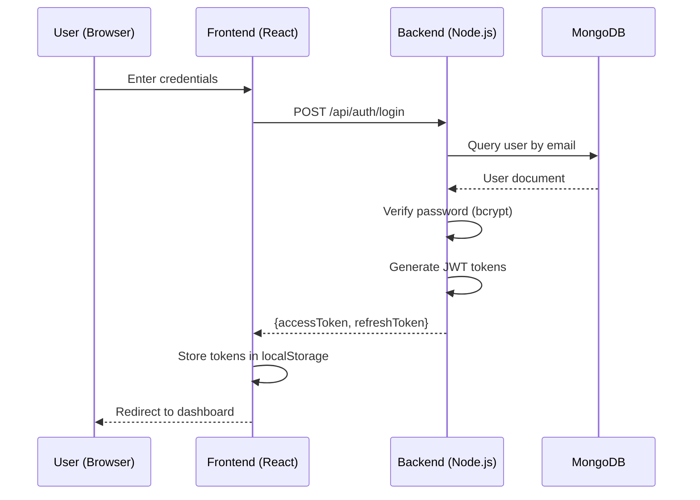
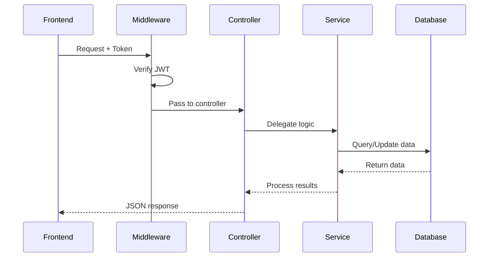
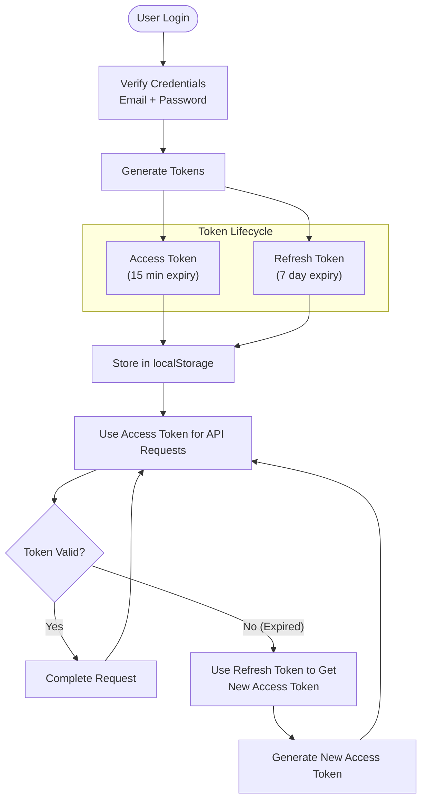
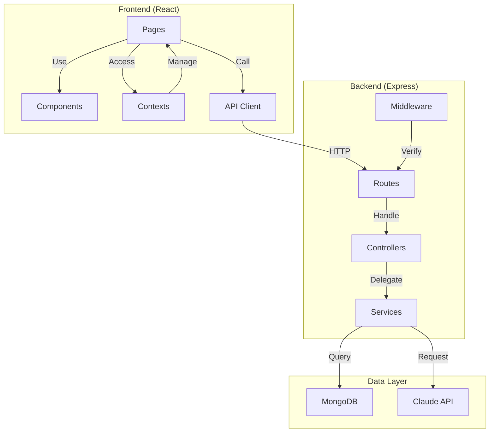

# 🏗️ Architecture Overview

## System Design

EcoManage follows a modern **three-tier architecture** pattern with clear separation of concerns:



---

## Application Layers

### 1. **Presentation Layer** (Frontend)

**Purpose**: User interface and client-side logic

**Components**:
- **Pages**: Dashboard, Analytics, Monitoring, Financial, Optimization, Alerts, Settings
- **Components**: Reusable UI elements (Card, Button, Chart, Sidebar, etc.)
- **Contexts**: Global state management (AuthContext)
- **Hooks**: Custom React hooks for API calls and data management
- **API Modules**: Axios-based API client wrappers

**Technologies**:
- React 18 with TypeScript
- Shadcn/UI + Tailwind CSS
- React Router for navigation
- Recharts for data visualization
- Axios for HTTP requests

**Responsibilities**:
- Render user interface
- Handle user interactions
- Client-side state management
- API request/response handling
- Theme management (light/dark)

### 2. **Application Layer** (Backend)

**Purpose**: Business logic and request processing

**Components**:
- **Routes**: Define API endpoints
- **Controllers**: Handle HTTP requests and responses
- **Services**: Business logic and data processing
- **Middleware**: Authentication, error handling, validation
- **Models**: Data schemas and validation

**Technologies**:
- Node.js with Express.js
- JWT for authentication
- Bcrypt for password hashing
- Mongoose for MongoDB operations
- TypeScript for type safety

**Responsibilities**:
- Process API requests
- Implement business logic
- Validate input data
- Manage authentication and authorization
- Interact with databases
- Handle errors and logging
- Cache management

### 3. **Data Layer** (Storage)

**Purpose**: Persistent data storage

**Components**:
- **MongoDB**: NoSQL document database
- **Collections**: Users, Devices, Alerts, Analytics, Financials
- **Indexes**: Performance optimization

**Responsibilities**:
- Store user data
- Store device and monitoring data
- Store financial and alert information
- Maintain data integrity
- Support querying and aggregation

---

## Data Flow

### Authentication Flow



### API Request Flow



---

## Module Structure

### Frontend (`client/src/`)

```
client/src/
├── api/                    # API client wrappers
│   ├── auth.ts
│   ├── dashboard.ts
│   ├── analytics.ts
│   ├── devices.ts
│   ├── financial.ts
│   ├── optimization.ts
│   └── alerts.ts
├── components/             # Reusable UI components
│   ├── ProtectedRoute.tsx
│   ├── Sidebar.tsx
│   ├── Header.tsx
│   ├── DashboardHeader.tsx
│   └── ui/                # Shadcn/UI components
├── contexts/              # React contexts (global state)
│   └── AuthContext.tsx
├── hooks/                 # Custom React hooks
│   └── useToast.ts
├── lib/                   # Utility functions
│   └── utils.ts
├── pages/                 # Page components
│   ├── Login.tsx
│   ├── Register.tsx
│   ├── Dashboard.tsx
│   ├── Analytics.tsx
│   ├── Monitoring.tsx
│   ├── Financial.tsx
│   ├── Optimization.tsx
│   ├── Alerts.tsx
│   ├── Settings.tsx
│   └── LandingPage.tsx
├── App.tsx                # Main app component
└── main.tsx               # React entry point
```

### Backend (`server/src/`)

```
server/src/
├── controllers/           # Request handlers
│   ├── authController.ts
│   ├── dashboardController.ts
│   ├── analyticsController.ts
│   ├── devicesController.ts
│   ├── financialController.ts
│   ├── optimizationController.ts
│   └── alertsController.ts
├── middleware/            # Express middleware
│   ├── auth.ts           # JWT verification
│   ├── errorHandler.ts   # Error handling
│   └── validation.ts     # Input validation
├── models/                # Mongoose models
│   ├── User.ts
│   ├── Device.ts
│   ├── Alert.ts
│   ├── Financial.ts
│   └── Analytics.ts
├── routes/                # API routes
│   ├── auth.ts
│   ├── dashboard.ts
│   ├── analytics.ts
│   ├── devices.ts
│   ├── financial.ts
│   ├── optimization.ts
│   └── alerts.ts
├── services/              # Business logic
│   ├── authService.ts
│   ├── dashboardService.ts
│   ├── analyticsService.ts
│   ├── devicesService.ts
│   ├── financialService.ts
│   ├── optimizationService.ts
│   ├── alertsService.ts
│   └── llmService.ts      # Claude API integration
├── scripts/               # Utility scripts
│   └── seed.ts           # Database seeding
├── config/                # Configuration
│   └── database.ts        # MongoDB connection
└── app.ts                 # Express app setup
```

---

## API Architecture

### Request/Response Pattern

```typescript
// Request
POST /api/dashboard/overview
Authorization: Bearer <JWT_TOKEN>
Content-Type: application/json

// Response (200 OK)
{
  "status": "success",
  "data": {
    "totalProduction": 250,
    "currentPower": 45,
    "dailyProduction": 480,
    "monthlyProduction": 14400,
    "systemStatus": "optimal",
    "weatherCondition": "sunny",
    "temperature": 22,
    "savings": 1250,
    "carbonOffset": 15
  }
}
```

### Error Handling

```typescript
// Error Response (400 Bad Request)
{
  "status": "error",
  "code": "VALIDATION_ERROR",
  "message": "Invalid input data",
  "details": [
    {
      "field": "email",
      "message": "Invalid email format"
    }
  ]
}
```

---

## Authentication & Security

### JWT Token Flow



### Password Security

1. **Hashing**: Bcrypt with 10+ salt rounds
2. **Never Store**: Plain text passwords are never stored
3. **Comparison**: Constant-time comparison to prevent timing attacks
4. **HTTPS**: All production traffic uses HTTPS

---

## Database Schema

### Users Collection

```typescript
{
  _id: ObjectId,
  email: string,
  name: string,
  password: string (hashed),
  createdAt: Date,
  updatedAt: Date
}
```

### Devices Collection

```typescript
{
  _id: ObjectId,
  userId: ObjectId (reference to Users),
  name: string,
  type: "solar" | "wind" | "battery",
  maxOutput: number,
  currentOutput: number,
  efficiency: number,
  status: "online" | "offline" | "charging",
  lastMaintenance: Date,
  createdAt: Date,
  updatedAt: Date
}
```

### Alerts Collection

```typescript
{
  _id: ObjectId,
  userId: ObjectId,
  type: string,
  severity: "low" | "medium" | "high",
  message: string,
  isRead: boolean,
  timestamp: Date,
  createdAt: Date
}
```

---

## Caching Strategy

### Frontend Caching
- **LocalStorage**: JWT tokens, user preferences
- **Browser Cache**: Static assets (images, CSS, JS)
- **Memory Cache**: API responses via Context API

### Backend Caching
- **In-Memory**: Frequently accessed data
- **Database Indexes**: Fast queries
- **Query Optimization**: Aggregation pipelines

---

## Performance Optimizations

### Frontend
1. **Code Splitting**: Lazy load routes
2. **Tree Shaking**: Remove unused code
3. **Image Optimization**: Compressed and responsive images
4. **CSS Optimization**: Tailwind CSS purging
5. **Bundle Size**: Minimize JavaScript bundle

### Backend
1. **Database Indexing**: Index frequently queried fields
2. **Query Optimization**: Lean queries, field selection
3. **Pagination**: Limit results per request
4. **Response Compression**: Gzip compression
5. **Connection Pooling**: Efficient database connections

### API Response Times
- Dashboard overview: <100ms
- Analytics data: <200ms
- Device list: <50ms
- Auth endpoints: <300ms

---

## Scalability Considerations

### Horizontal Scaling
- **Stateless API**: JWT-based auth allows multiple instances
- **Database**: MongoDB sharding for large datasets
- **Load Balancing**: Distribute requests across servers
- **CDN**: Serve static assets globally

### Vertical Scaling
- **Caching Layer**: Redis for frequently accessed data
- **Database Optimization**: Better indexes and query optimization
- **Resource Limits**: Configure memory and CPU limits

---

## Development Workflow

### Local Development

1. **Setup**: `npm install` in both client and server
2. **Environment**: Create `.env` files with configuration
3. **Database**: Start MongoDB via Docker
4. **Backend**: `npm run dev` in server directory
5. **Frontend**: `npm run dev` in client directory
6. **Testing**: `npm test` in respective directories

### Deployment

1. **Build**: Create optimized builds
2. **Docker**: Build Docker images
3. **Registry**: Push to container registry
4. **Deployment**: Deploy via Docker Compose or Kubernetes
5. **Monitoring**: Setup logs and metrics

---

## Technologies & Justification

| Component | Technology | Reason |
|-----------|-----------|--------|
| Frontend Framework | React | Large ecosystem, community support, reusable components |
| Language | TypeScript | Type safety, better IDE support, catch errors early |
| UI Framework | Shadcn/UI | Accessible, customizable, built on Radix |
| Styling | Tailwind CSS | Utility-first, fast development, small bundle |
| Backend | Node.js + Express | JavaScript, fast, lightweight, good for APIs |
| Database | MongoDB | Flexible schema, scalable, good for IoT/analytics |
| Authentication | JWT | Stateless, scalable, fits REST architecture |
| Visualization | Recharts | React-friendly, interactive, responsive |
| Testing | Playwright + Jest | Comprehensive, E2E + Unit testing, good coverage |

---

## Future Enhancements

### Short Term (v1.1)
- [ ] WebSocket for real-time updates
- [ ] Database replication for HA
- [ ] Enhanced caching strategy
- [ ] API rate limiting

### Medium Term (v1.2)
- [ ] GraphQL API option
- [ ] Mobile app (React Native)
- [ ] Advanced reporting and exports
- [ ] Multi-user team management

### Long Term (v2.0)
- [ ] Machine learning for predictions
- [ ] Advanced anomaly detection
- [ ] Integration with IoT devices
- [ ] Blockchain for audit trail

---

## Diagram: Component Interaction



---

[⬆ Back to Top](#-architecture-overview)
