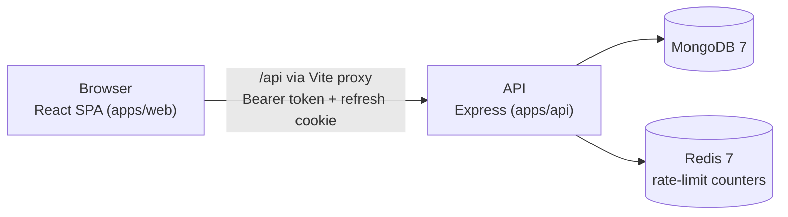
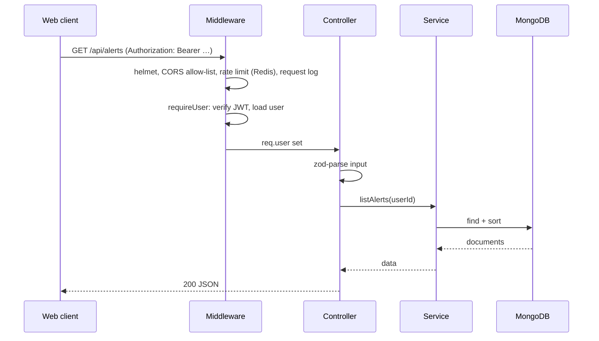
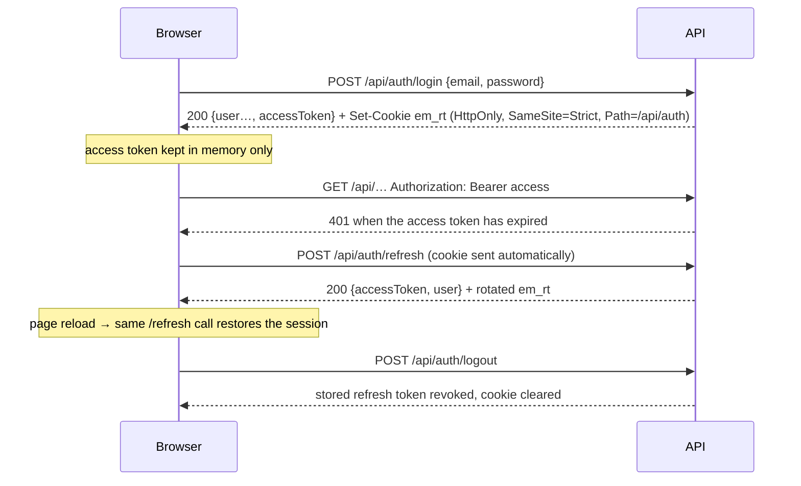
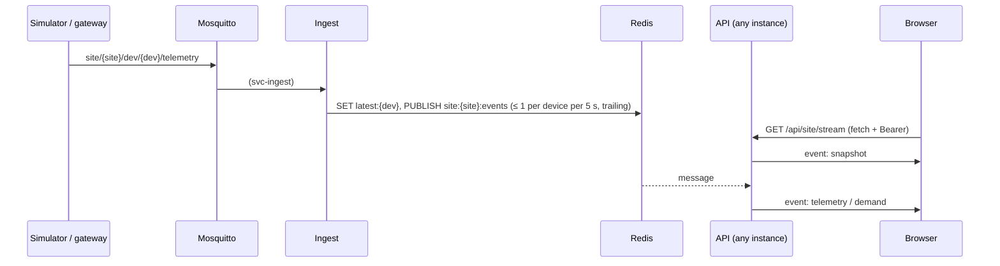

# Architecture

This describes the code as it is after v2 Phase 0. The v2 target architecture (ingest, rules,
worker and simulator apps; MQTT; tariffs) is in the design handoff's `IMPLEMENTATION_PLAN.md` and
is added phase by phase.

## Overview


```mermaid
graph LR
    Browser["Browser<br/>React SPA (apps/web)"] -- "/api via Vite proxy<br/>Bearer token + refresh cookie" --> API["API<br/>Express (apps/api)"]
    API --> Mongo[("MongoDB 7")]
    API --> Redis[("Redis 7<br/>rate-limit counters")]
```

| Container    | Image / build          | Purpose                                   |
| ------------ | ---------------------- | ----------------------------------------- |
| `api`        | `Dockerfile.dev`       | `tsx watch` on `apps/api/src/server.ts`   |
| `web`        | `Dockerfile.dev`       | Vite dev server, proxies `/api` to `api`  |
| `mongodb`    | `mongo:7`              | Data store                                |
| `redis`      | `redis:7-alpine`       | Rate-limit store                          |
| `mosquitto`  | `eclipse-mosquitto:2`  | MQTT broker, TLS with client certificates, ACL per identity |
| `ingest`     | `Dockerfile.dev`       | MQTT → telemetry, latest values, 15-minute intervals, live events, command acks |
| `worker`     | `Dockerfile.dev`       | BullMQ jobs: interval costs, bills, statements, utility bills, emails |
| `rules`      | `Dockerfile.dev`       | Alert checks on every reading |
| `simulator`  | `Dockerfile.dev`       | Simulated demo site acting as its gateway over MQTT/TLS; control API on :4100 |
| `mailpit`    | `axllent/mailpit`      | Catches every email in development; UI on :8025 |
| `mqtt-certs` | `alpine`               | One-shot: generates the dev CA and certificates into `infra/mosquitto/certs` (gitignored) |
| `mongo-seed` | `Dockerfile.dev`       | One-shot demo data reset (profile `tools`, run on demand) |

The stack is defined in `infra/docker-compose.yml`. The source is bind-mounted into `/repo`. `node_modules` come from the image and sit in anonymous
volumes so the host never needs a local install.

## API (`apps/api/src`)

```
server.ts              env check, Redis, Mongo connection, listen
app.ts                 createApp(): middleware + module routers (used by tests too)
config/                env.ts (zod-validated), logger.ts (pino + redaction), database.ts
middleware/            auth.ts (requireUser), security.ts (CORS, helmet, rate limit, request log)
lib/http.ts            handle() wrapper, HttpError, parse() for zod, currentUser/userIdOf
utils/                 JWT, bcrypt and cookie helpers
modules/<name>/        routes.ts → controller.ts → service.ts → model.ts
scripts/               seed.ts / seedDemo.ts (demo data), migrate.ts / migrateV2.ts
```

Modules: `health`, `auth`, `site`, `devices`, `alerts`,
`optimization`.

### Layering rules

- **routes.ts** only wires middleware (`requireUser`) to controller functions.
- **controller.ts** parses `req.body`/`req.query` with zod, calls one service function and shapes
  the HTTP response. Each handler is wrapped in `handle(fallback, fn)`: a thrown `HttpError` becomes
  its status and body, anything else is logged and answered with the route's fallback error.
- **service.ts** holds the logic. It takes plain values (`userId`, inputs), returns data or `null`,
  and has no Express types.
- **model.ts** is the Mongoose schema.

### Request flow


```mermaid
sequenceDiagram
    participant W as Web client
    participant M as Middleware
    participant C as Controller
    participant S as Service
    participant DB as MongoDB
    W->>M: GET /api/alerts (Authorization: Bearer …)
    M->>M: helmet, CORS allow-list, rate limit (Redis), request log
    M->>M: requireUser: verify JWT, load user
    M->>C: req.user set
    C->>C: zod-parse input
    C->>S: listAlerts(userId)
    S->>DB: find + sort
    DB-->>S: documents
    S-->>C: data
    C-->>W: 200 JSON
```

### Authentication


```mermaid
sequenceDiagram
    participant B as Browser
    participant A as API
    B->>A: POST /api/auth/login {email, password}
    A-->>B: 200 {user…, accessToken} + Set-Cookie em_rt (HttpOnly, SameSite=Strict, Path=/api/auth)
    Note over B: access token kept in memory only
    B->>A: GET /api/… Authorization: Bearer access
    A-->>B: 401 when the access token has expired
    B->>A: POST /api/auth/refresh (cookie sent automatically)
    A-->>B: 200 {accessToken, user} + rotated em_rt
    Note over B: page reload → same /refresh call restores the session
    B->>A: POST /api/auth/logout
    A-->>B: stored refresh token revoked, cookie cleared
```

- Access tokens last 1 day and refresh tokens 30 days. The user document stores the current
  refresh token, so a refresh with an older (rotated) one is rejected.
- Several requests that fail with 401 at once share a single refresh call in the client.
- `requireUser` answers 401 for a missing, invalid or expired token. A failed user lookup is a 500.

### Errors

v1 routes keep their original error bodies, `{ "error": "…" }` or `{ "message": "…" }` depending
on the module (see the API reference). New middleware errors use `{ "error": { "code", "message" } }`,
the v2 shape: 404 for unknown routes, 429 for rate limits, 500 for unhandled errors.

## Web client (`apps/web/src`)

```
api/            axios wrappers per module, types.ts (response shapes), api.ts (token + refresh)
contexts/       AuthContext: session restore, login/register/logout, user
components/     layout, header (alert badge), energy flow diagram, shadcn/ui in ui/
pages/          Landing, Login, Register, Live (home), Monitoring (devices), Optimization,
                Alerts, Settings
lib/            utils, alertEvents (header refresh + 30 s poll interval)
```

Routes: `/`, `/login`, `/register`, and `/dashboard` (the live view) with the children
`monitoring`, `optimization`, `alerts` and `settings`. `ProtectedRoute` waits for the session
restore before redirecting.

## Data

See [DATABASE.md](./DATABASE.md). Devices report power in the site sign convention (positive into
the switchboard: PV, battery discharge, grid import; loads negative) plus cumulative energy
counters. Readings land in the `telemetry` time series, and the 15-minute `intervals15` roll-up
holds energy per source and consumer, the building remainder and demand.

## Tech stack

| Area        | Choice                                                         |
| ----------- | -------------------------------------------------------------- |
| Runtime     | Node 20, TypeScript 5.6 (strict)                               |
| API         | Express 4, Mongoose 8, zod, pino, helmet, express-rate-limit + rate-limit-redis, ioredis, jsonwebtoken, bcryptjs |
| Web         | React 18, Vite 5, Tailwind 3, shadcn/ui (Radix), Recharts, axios, react-router 7 |
| Data        | MongoDB 7, Redis 7                                             |
| Tests       | Jest + ts-jest + supertest (API), Vitest + Testing Library + MSW (web) |
| Tooling     | pnpm 9 workspace, ESLint 9 flat config, Docker Compose         |

## Simulator (`apps/simulator`)

A stand-in for the site gateway (spec §7). It uses the same MQTT topics, certificate and command
handling as a real one, so the backend can't tell the two apart.

- `engine/`: deterministic physics per seed. Clear-sky solar for the site's latitude times a
  seeded daily cloud factor (the solar model and weather profile live in `packages/shared`, so the
  PV forecast uses the same ones); school load profile from the calendar (terms, days off, opening
  hours); heat pump driven by temperature and SG-Ready mode; EV sessions (buses, staff cars)
  honouring current limits and schedules; battery with round-trip losses in self-consumption
  mode unless commanded. The grid meter is the remainder. Every device integrates its own
  energy counters.
- `gateway.ts`: publishes each device every 5 simulated seconds (once per real second above
  5×); buffers while the gateway is "offline". On reconnect it reports its status first (with
  the backlog), then drains one `{items}` batch of 500 per tick. New readings queue behind the
  backlog, so everything arrives in time order. It applies the retained config (battery floor); checks
  command expiry and profile write limits before acking; answers scan, commission and restart jobs.
- Faults (`POST /sim/faults {type, device?, minutes?}`): `device-offline`, `meter-gap`,
  `gateway-offline`, `command-rejected`, `output-drop`. A `reset` or `restart` command brings an
  offline device back. `DELETE /sim/faults` clears them, `POST /sim/clock {speed}` changes the
  speed (1–60), `GET /sim/state` shows time, weather, battery and faults.
- Start options: `--speed`, `--seed`, `--start` (or `SIM_SPEED`, `SIM_SEED`, `SIM_START`).
- Energy counters behave like real ones. They start from the site's average power since
  commissioning (14 Mar 2024). Counters and battery charge are saved every 30 s to
  `SIM_STATE_FILE` (the `simulator_state` volume in compose), and a restart resumes from them,
  adding average power for the downtime. Meter and inverter readings carry ±0.25% measurement
  noise; the counters integrate the true power.

With seed 42 on 24 Sep 2026, a school day, the uncontrolled 15-minute grid peak is 130 kW at
15:15, matching the App v2 peak-shaving story.

### Gateway config (P2-06)

The API connects with the `svc-api` certificate. Its ACL may write `site/+/config`. It publishes
the retained `site/{siteId}/config` message `{ ts, batteryFloorPct }` when the battery floor
changes in Settings. A gateway gets the message on every (re)subscribe and enforces the floor
itself: no reserve or command may go below it. The simulator applies it even while its simulated
uplink is down. If the broker is unreachable, the site is flagged `gatewayConfigPending`, and the
API sends the config again on its next connect.

## Ingest (`apps/ingest`)

Subscribes with the `svc-ingest` certificate to telemetry, device status and gateway status for
every site (QoS 1, persistent session).

- Telemetry is checked against the zod schema, then against the device record: it must exist and
  belong to the site in the topic, and every field must be declared by its profile. Rejections
  are counted and logged.
- Duplicates are dropped on `(deviceId, ts)` with Redis `SET NX` markers kept for 8 days (longer
  than the 7-day gateway buffer).
- Readings more than 15 minutes old on arrival get `q: "backfilled"`.
- Rows are written to the `telemetry` time series in batches, every 500 ms or at 1000 rows.
  `latest:{deviceId}` in Redis holds the newest reading. The device's `lastSeenAt` is the
  receive time, and a stale or offline device goes back to `live` (pending devices stay pending).
- Every 10 s, devices silent for 60 s become `stale` and after 5 min `offline`.
- Gateway status goes to `gw:{siteId}` and device status to `status:{deviceId}` in Redis.
- A command ack (`site/{id}/cmd/{commandId}/ack`) moves its `sent` command to `acked` or
  `failed` (with the gateway's error), and publishes a `command` event (P2-08). Acks from another
  site, for unknown ids, or repeated acks change nothing.

### 15-minute intervals (`apps/ingest/src/intervals.ts`)

Every 15 s ingest flushes its rows and rolls up each closed interval (30 s grace for readings in
flight) into `intervals15`, one row per site and quarter hour (upsert):

- Energy per device is the difference of its cumulative counters at the two boundaries. The last
  reading within 60 s before a boundary is carried forward to it using that reading's power.
- `grid`/`export` come from the meter's import/export counters, and `demandKw` = import kWh × 4.
  `pv`, `batt` (discharge minus charge), `ev` and `hp` come from their devices. `bld` is the
  remainder (grid − export + pv + batt − ev − hp), and `used` = pv − export.
- If a device has readings but no counter at a boundary, average power × 0.25 h is used and
  the interval is `estimated`. If the meter is silent for the whole interval, grid comes from
  the balance using the previous interval's building load (`estimated`).
- A reading stored for an interval that has already closed (a gateway resend) marks it dirty,
  and it is recomputed on the next pass; so is the following interval if it was estimated.
- After a restart it resumes from the last stored interval, or from the site's first reading,
  catching up at most a week at a time.

- Every write clears `costedAt`, so the worker prices the interval again.

## Worker (`apps/worker`, P2-03)

BullMQ on the compose Redis, queue `billing`, one job at a time:

- `cost-intervals`, every 60 s: prices each interval whose `costedAt` is null with the tariff
  version valid on its local date (`touSplit` of `grid` into `costCents.pk/md/op`, and
  `creditCents` = export × export rate), then recomputes the bill of each billing period it
  touched. An interval that ingest rewrote in the meantime stays pending (the update matches on
  `updatedAt`).
- `nightly-bills`, hourly at :05: for each site whose local time is 01:xx, recomputes the bills
  for the current and previous periods.

A bill (`bills`, one per site and period) is
`Σ energy × the version in force on each day + peak demand × demand rate + fixed fee − export credit`.
Energy lines are summed from exact values and rounded once per line, not per interval. Demand and
the fixed fee use the version in force on the period's last day (today, for an open period);
`peakKw` is the highest 15- or 30-minute demand (`periodPeak`). The bill also stores which
versions priced it, the share of `estimated` intervals and any intervals no tariff covers.

Savings (P2-04) compare each bill with the same site load bought entirely from the grid on the
same tariff. Per interval, load = grid − export + pv + batt, so the energy saving splits exactly
into **solar** (cost of pv − export at its period price, plus the export credit) and **battery
shifting** (signed cost of battery kWh: discharge at dear periods minus charge at cheap ones).
**Demand avoided** is the baseline peak (load × 4) minus the actual peak, at the demand rate.
`savedCents` is the sum of the three and `baselineCents` = `totalCents` + `savedCents`. Both stay
null until the site has 7 days (672) of intervals.

The `documents` queue (P2-05) runs on demand, two at a time:

- `statement`: renders the bill to PDF with pdfkit, stores it in GridFS (bucket `files`, metadata
  `{ siteId, kind, contentType }`) and remembers `{ fileId, renderedAt }` on the bill. The API waits
  for the result (up to 30 s) and serves the stored copy until the bill changes.
- `utility-bill`: reads an uploaded bill's total. It uses the PDF's text (unpdf) or the CSV
  template, sets `utility.status` to `done` with `diffCents` = ours − utility, or to `failed` so the
  owner can type the total in. A job for a file that a newer upload replaced does nothing.
  Recomputing a bill keeps `diffCents` in step with our total.

The `email` queue (P2-09) runs every 30 s and sends through SMTP (Mailpit in development):

- **Alerts:** each new warning or failure (not `info`) goes to every current member who wants it.
  - Warnings wait until that person's quiet hours end (site time).
  - Command failures always send, and always to owners and managers.
  - A paused (snoozed) alert sends nothing.
  - Alerts older than 24 h aren't emailed.
- **Escalation:** an alert still `open` (not acknowledged) after the owner's `escalateMin` is emailed to the owner once.
- **Daily summary:** in the hour after 07:00 site time, once per site and day. It covers yesterday's energy cost, grid kWh, peak demand, and solar and battery savings (computed with the shared bill maths), plus open alerts.
- **Sending once:** each email's key is first claimed in `emails` (unique), then the mail is sent and marked `sent`. A failed send drops the claim so the next pass retries, and a restart or a second worker never sends twice. Keys:
  - `alert:{alertId}:{userId}`
  - `escalation:{alertId}:{userId}`
  - `daily:{siteId}:{date}:{userId}`

The `forecast` queue (P2-10) issues each site's PV and load forecasts for the next 48 h in 15-minute steps. It runs every hour, and once at start-up. A single site is redone when its calendar or its solar arrays change.
- **Weather** comes from `WEATHER_PROVIDER`:
  - `simulated` (the default) is the simulator's own seeded profile, from `packages/shared/src/weather.ts` with `WEATHER_SEED` = `SIM_SEED`. So the simulated site is forecast from the weather it will actually get.
  - `open-meteo` is the real service: hourly temperature and cloud cover, interpolated, with cloud cover converted by Kasten–Czeplak.
- **PV** uses the same clear-sky model as the simulator (`packages/shared/src/solar.ts`) × cloud × each array's geometry.
  - The geometry factor is relative to the demo's 10° south arrays, which the simulator is calibrated to.
  - Output is summed per inverter and capped at its rating.
- **Load** is site consumption (grid − export + PV + battery):
  - It averages the same local time on history days (last 6 weeks) of the same weekday and calendar class. The class is open or closed, from terms, days off and weekends; without a calendar, weekdays count as open.
  - With fewer than two such days, it uses every day of that class.
  - It then applies × (1 + s × Δ degrees outside 13–20 °C). The sensitivity `s` is fitted from the history, at most 10% per degree.
  - It needs 7 days of intervals.
- **Accuracy:** a day later, each forecast is scored against the meter. The MAPE covers daylight steps for PV (at least 5% of kWp) and steps of at least 1 kW for load. It is stored on the forecast and logged (`forecast accuracy (MAPE %)`).
  - On two weeks of the simulated site, the day-ahead MAPE is about 5% for PV and 7% for load (worker test).
- Forecasts expire after 30 days.

## Rules (`apps/rules`, P2-07)

The alert engine. It subscribes to `site:*:events` in Redis. Each reading ingest publishes marks
its site for evaluation, at most once every 2 s per site. Every 15 s it also evaluates every site,
so time-based checks fire even when nothing arrives. It never commands a device (plan rule 9);
recommendations join it in Phase 3.

Each check in `checks.ts` is a pure function of a `SiteContext`:
- devices with their latest readings (Redis `latest:*`)
- the gateway status (`gw:*`)
- the last `demand` event
- commands that are sent or recently failed
- 5-minute PV buckets for the last 3 h

Each check returns findings and the (rule, device) pairs it could judge.

| Rule | Condition | Clears |
| ---- | --------- | ------ |
| `device-silent` | a device silent over 5 min, counted from its last reading, or from when it was added if it never reported | it reports again |
| `pv-underperform` | an inverter under 90% of expected for the last 24 daylight buckets (2 h) | 12 buckets (1 h of daylight) within 5% of expected |
| `battery-below-reserve` | a fresh reading shows SoC more than 0.5 points under the reserve | SoC at the reserve |
| `demand-near-cap` | this interval's projected demand at 90% of the cap or more | under 85% |
| `command-ack-slow` | a command sent over 30 s ago without an ack (one alert per device) | one-off: the condition clears when it is acked or fails, and the alert stays open until someone closes it with a cause |
| `command-failed` | an event: each failed command of the last 24 h | never by itself; a person resolves it |
| `gateway-buffer` | the gateway reports buffered readings older than 1 h | the backlog is newer than 1 h |

Until the PV forecast exists (P2-10), "expected" comes from the other inverters. It is this
inverter's kWp × (their kW ÷ their kWp) in the same bucket. Buckets where the peers make under
5% of their rating count as night and aren't judged, and a site with one inverter isn't judged.

`reconcile.ts` turns findings into `alerts`, with at most one open or acked alert per (site,
device, rule). A unique partial index enforces this, even if two rules processes race.
- A new finding opens an alert, unless a `ruleMutes` entry covers the rule and the device (or
  the whole site).
- An open condition alert whose pair was judged and not found resolves itself:
  `resolution { cause: "Condition cleared", auto: true }`.
- Pairs that couldn't be judged leave their alerts alone. Examples: a stale battery reading, or
  night for PV.
- One-off alerts (a late ack) only mark their condition `cleared` and wait for a person.
- Event alerts start with `condition: "cleared"` and count each new command id once.
- An occurrence someone already resolved doesn't reopen.
- Opened, resolved and counted alerts are published as `alert` events on the site channel, and
  the SSE stream forwards them.

## Live view (P1-08)


```mermaid
sequenceDiagram
    participant GW as Simulator / gateway
    participant B as Mosquitto
    participant I as Ingest
    participant R as Redis
    participant A as API (any instance)
    participant W as Browser
    GW->>B: site/{site}/dev/{dev}/telemetry
    B->>I: (svc-ingest)
    I->>R: SET latest:{dev}, PUBLISH site:{site}:events (≤ 1 per device per 5 s, trailing)
    W->>A: GET /api/site/stream (fetch + Bearer)
    A->>W: event: snapshot
    R-->>A: message
    A->>W: event: telemetry / demand
```

The browser applies each event to the cached snapshot (react-query) with `applySiteEvent`, which
reuses the shared `siteFlows` / `batteryLive` functions, so its numbers match the API's.
Measured through the web dev server's proxy: telemetry reaches the browser about 0.66 s after
the simulator stamps it.
