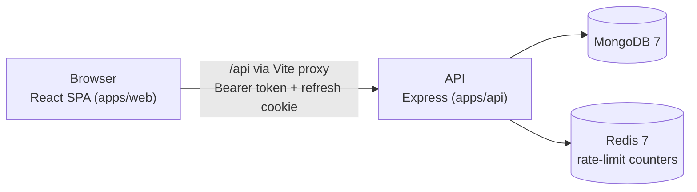
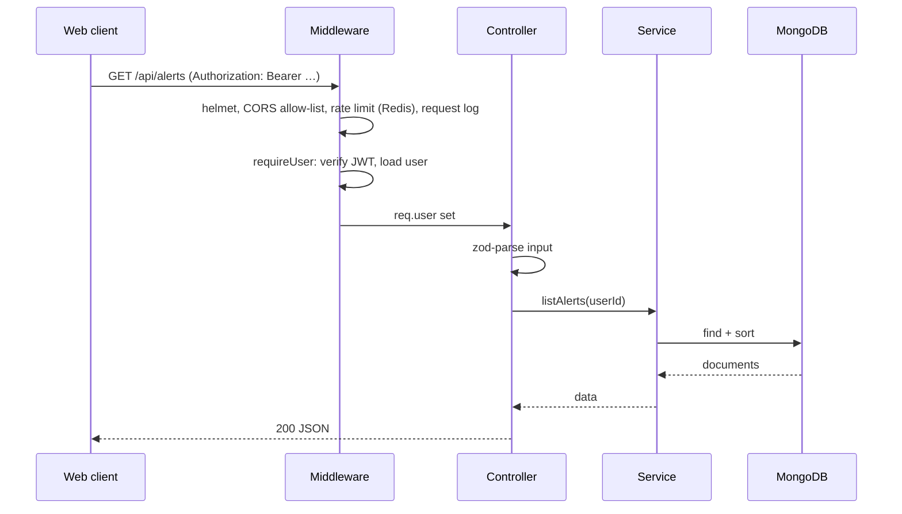
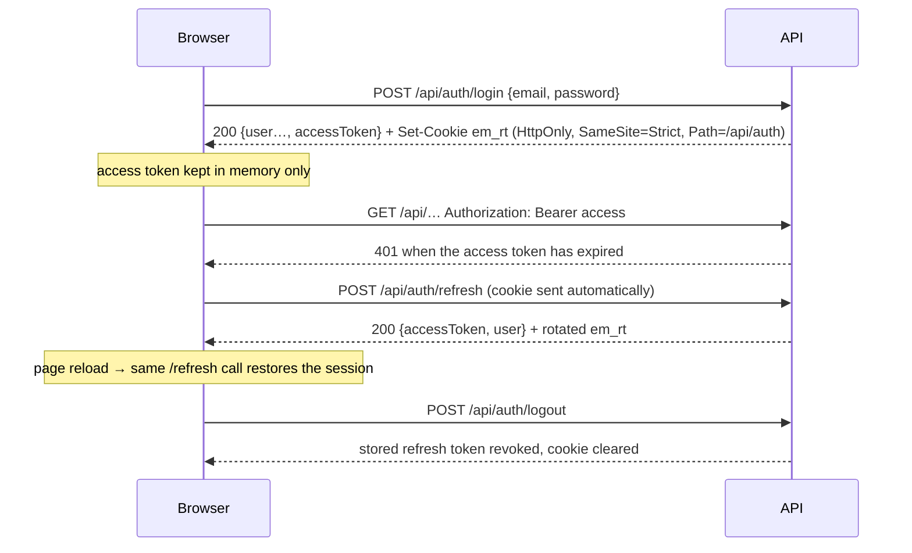

# Architecture

This describes the code as it is after v2 Phase 0. The v2 target architecture (ingest, rules,
worker and simulator apps; MQTT; tariffs) is in the design handoff's `IMPLEMENTATION_PLAN.md` and
is added phase by phase.

## Overview


```mermaid
graph LR
    Browser["Browser<br/>React SPA (apps/web)"] -- "/api via Vite proxy<br/>Bearer token + refresh cookie" --> API["API<br/>Express (apps/api)"]
    API --> Mongo[("MongoDB 7")]
    API --> Redis[("Redis 7<br/>rate-limit counters")]
```

| Container    | Image / build          | Purpose                                   |
| ------------ | ---------------------- | ----------------------------------------- |
| `api`        | `Dockerfile.dev`       | `tsx watch` on `apps/api/src/server.ts`   |
| `web`        | `Dockerfile.dev`       | Vite dev server, proxies `/api` to `api`  |
| `mongodb`    | `mongo:7`              | Data store                                |
| `redis`      | `redis:7-alpine`       | Rate-limit store                          |
| `mosquitto`  | `eclipse-mosquitto:2`  | MQTT broker, TLS with client certificates, ACL per identity |
| `mqtt-certs` | `alpine`               | One-shot: generates the dev CA and certificates into `infra/mosquitto/certs` (gitignored) |
| `mongo-seed` | `Dockerfile.dev`       | One-shot demo data reset (profile `tools`, run on demand) |

The stack is defined in `infra/docker-compose.yml`. The source is bind-mounted into `/repo`. `node_modules` come from the image and sit in anonymous
volumes so the host never needs a local install.

## API (`apps/api/src`)

```
server.ts              env check, Redis, Mongo connection, listen
app.ts                 createApp(): middleware + module routers (used by tests too)
config/                env.ts (zod-validated), logger.ts (pino + redaction), database.ts
middleware/            auth.ts (requireUser), security.ts (CORS, helmet, rate limit, request log)
lib/http.ts            handle() wrapper, HttpError, parse() for zod, currentUser/userIdOf
utils/                 JWT, bcrypt and cookie helpers
modules/<name>/        routes.ts → controller.ts → service.ts → model.ts
scripts/               seed.ts, seedReadings.ts (hourly demo data generator)
```

Modules: `health`, `auth`, `dashboard`, `analytics`, `alerts`, `devices`, `financial`,
`optimization`.

### Layering rules

- **routes.ts** only wires middleware (`requireUser`) to controller functions.
- **controller.ts** parses `req.body`/`req.query` with zod, calls one service function and shapes
  the HTTP response. Each handler is wrapped in `handle(fallback, fn)`: a thrown `HttpError` becomes
  its status and body, anything else is logged and answered with the route's fallback error.
- **service.ts** holds the logic. It takes plain values (`userId`, inputs), returns data or `null`,
  and has no Express types.
- **model.ts** is the Mongoose schema.

### Request flow


```mermaid
sequenceDiagram
    participant W as Web client
    participant M as Middleware
    participant C as Controller
    participant S as Service
    participant DB as MongoDB
    W->>M: GET /api/alerts (Authorization: Bearer …)
    M->>M: helmet, CORS allow-list, rate limit (Redis), request log
    M->>M: requireUser: verify JWT, load user
    M->>C: req.user set
    C->>C: zod-parse input
    C->>S: listAlerts(userId)
    S->>DB: find + sort
    DB-->>S: documents
    S-->>C: data
    C-->>W: 200 JSON
```

### Authentication


```mermaid
sequenceDiagram
    participant B as Browser
    participant A as API
    B->>A: POST /api/auth/login {email, password}
    A-->>B: 200 {user…, accessToken} + Set-Cookie em_rt (HttpOnly, SameSite=Strict, Path=/api/auth)
    Note over B: access token kept in memory only
    B->>A: GET /api/… Authorization: Bearer access
    A-->>B: 401 when the access token has expired
    B->>A: POST /api/auth/refresh (cookie sent automatically)
    A-->>B: 200 {accessToken, user} + rotated em_rt
    Note over B: page reload → same /refresh call restores the session
    B->>A: POST /api/auth/logout
    A-->>B: stored refresh token revoked, cookie cleared
```

- Access tokens last 1 day and refresh tokens 30 days. The user document stores the current
  refresh token, so a refresh with an older (rotated) one is rejected.
- Several requests that fail with 401 at once share a single refresh call in the client.
- `requireUser` answers 401 for a missing, invalid or expired token. A failed user lookup is a 500.

### Errors

v1 routes keep their original error bodies, `{ "error": "…" }` or `{ "message": "…" }` depending
on the module (see the API reference). New middleware errors use `{ "error": { "code", "message" } }`,
the v2 shape: 404 for unknown routes, 429 for rate limits, 500 for unhandled errors.

## Web client (`apps/web/src`)

```
api/            axios wrappers per module, types.ts (response shapes), api.ts (token + refresh)
contexts/       AuthContext: session restore, login/register/logout, user
components/     layout, header (alert badge), energy flow diagram, shadcn/ui in ui/
pages/          Landing, Login, Register, Dashboard, Monitoring, Analytics, Optimization,
                Alerts, Financial, Settings
lib/            utils, alertEvents (header refresh + 30 s poll interval)
```

Routes: `/`, `/login`, `/register`, and `/dashboard` with the children `monitoring`, `analytics`,
`optimization`, `alerts`, `financial` and `settings`. `ProtectedRoute` waits for the session
restore before redirecting.

## Data

See [DATABASE.md](./DATABASE.md). Readings are hourly kWh values in `energyreadings`. Production
comes from solar and wind devices; site consumption is metered on the grid meter device. The
dashboard computes grid flow as consumption − production − battery discharge, where positive
means importing.

## Tech stack

| Area        | Choice                                                         |
| ----------- | -------------------------------------------------------------- |
| Runtime     | Node 20, TypeScript 5.6 (strict)                               |
| API         | Express 4, Mongoose 8, zod, pino, helmet, express-rate-limit + rate-limit-redis, ioredis, jsonwebtoken, bcryptjs |
| Web         | React 18, Vite 5, Tailwind 3, shadcn/ui (Radix), Recharts, axios, react-router 7 |
| Data        | MongoDB 7, Redis 7                                             |
| Tests       | Jest + ts-jest + supertest (API), Vitest + Testing Library + MSW (web) |
| Tooling     | pnpm 9 workspace, ESLint 9 flat config, Docker Compose         |
