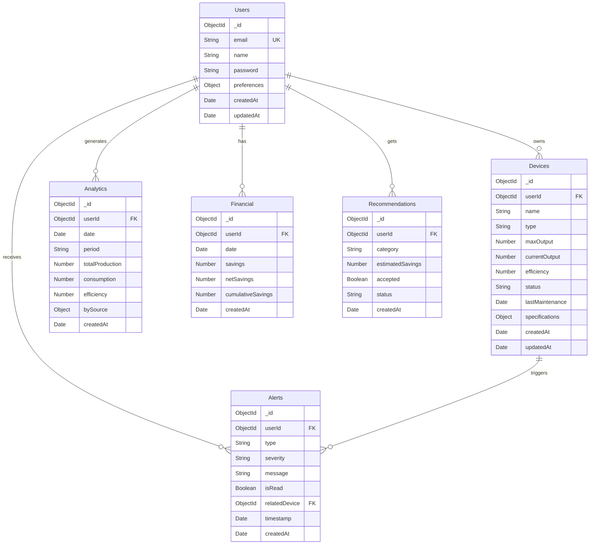

# 🗄️ Database Schema

## Overview

EcoManage uses **MongoDB** with Mongoose ODM for data persistence. The database is named `ecomanage` and contains the following collections.

---

## Collections

### Users

**Purpose**: Store user account information

```javascript
{
  _id: ObjectId,
  email: String (unique, lowercase),
  name: String,
  password: String (hashed),
  isActive: Boolean (default: true),
  preferences: {
    theme: "light" | "dark",
    language: String,
    notifications: {
      email: Boolean,
      push: Boolean,
      alerts: Boolean
    }
  },
  createdAt: Date (auto),
  updatedAt: Date (auto)
}
```

**Indexes**:
- `email` (unique)
- `createdAt` (for sorting)

**Example**:
```json
{
  "_id": "507f1f77bcf86cd799439011",
  "email": "john@example.com",
  "name": "John Doe",
  "password": "$2b$10$...",
  "isActive": true,
  "preferences": {
    "theme": "dark",
    "language": "en",
    "notifications": {
      "email": true,
      "push": true,
      "alerts": true
    }
  },
  "createdAt": "2024-01-10T10:00:00Z",
  "updatedAt": "2024-05-07T15:30:00Z"
}
```

---

### Devices

**Purpose**: Store energy generation/storage devices

```javascript
{
  _id: ObjectId,
  userId: ObjectId (ref: Users),
  name: String,
  type: "solar" | "wind" | "battery",
  maxOutput: Number (kW),
  currentOutput: Number (kW),
  efficiency: Number (0-100, percent),
  status: "online" | "offline" | "charging",
  lastMaintenance: Date,
  maintenanceSchedule: {
    interval: Number (days),
    lastPerformed: Date,
    nextDue: Date
  },
  specifications: {
    manufacturer: String,
    model: String,
    installDate: Date,
    warrantyExpiry: Date
  },
  metadata: Object,
  createdAt: Date (auto),
  updatedAt: Date (auto)
}
```

**Indexes**:
- `userId` (foreign key)
- `type` (for filtering)
- `status` (for monitoring)

**Example**:
```json
{
  "_id": "507f1f77bcf86cd799439012",
  "userId": "507f1f77bcf86cd799439011",
  "name": "Solar Panel Array A",
  "type": "solar",
  "maxOutput": 250,
  "currentOutput": 180,
  "efficiency": 95,
  "status": "online",
  "lastMaintenance": "2024-03-15T10:00:00Z",
  "maintenanceSchedule": {
    "interval": 180,
    "lastPerformed": "2024-03-15T10:00:00Z",
    "nextDue": "2024-09-11T10:00:00Z"
  },
  "specifications": {
    "manufacturer": "SunPower",
    "model": "SPR-A400",
    "installDate": "2023-06-20T00:00:00Z",
    "warrantyExpiry": "2033-06-20T00:00:00Z"
  },
  "createdAt": "2024-01-10T10:00:00Z",
  "updatedAt": "2024-05-07T15:30:00Z"
}
```

---

### Analytics

**Purpose**: Store historical analytics data

```javascript
{
  _id: ObjectId,
  userId: ObjectId (ref: Users),
  date: Date (daily record),
  period: "daily" | "weekly" | "monthly",
  totalProduction: Number (kWh),
  averageProduction: Number (kWh),
  peakProduction: Number (kWh),
  consumption: Number (kWh),
  efficiency: Number (percent),
  weatherCondition: String,
  temperature: Number (Celsius),
  bySource: {
    solar: Number,
    wind: Number,
    battery: Number,
    grid: Number
  },
  trends: [
    {
      timestamp: Date,
      value: Number
    }
  ],
  createdAt: Date (auto),
  updatedAt: Date (auto)
}
```

**Indexes**:
- `userId, date` (compound for efficient queries)
- `period` (for filtering)
- `date` (for time-range queries)

**Example**:
```json
{
  "_id": "507f1f77bcf86cd799439013",
  "userId": "507f1f77bcf86cd799439011",
  "date": "2024-05-07T00:00:00Z",
  "period": "daily",
  "totalProduction": 480,
  "averageProduction": 20,
  "peakProduction": 850,
  "consumption": 420,
  "efficiency": 94.2,
  "weatherCondition": "sunny",
  "temperature": 22,
  "bySource": {
    "solar": 350,
    "wind": 80,
    "battery": 50,
    "grid": 0
  },
  "trends": [
    {
      "timestamp": "2024-05-07T06:00:00Z",
      "value": 50
    }
  ],
  "createdAt": "2024-05-07T00:30:00Z",
  "updatedAt": "2024-05-07T23:59:00Z"
}
```

---

### Financial

**Purpose**: Store financial data and costs

```javascript
{
  _id: ObjectId,
  userId: ObjectId (ref: Users),
  date: Date,
  savings: Number (currency),
  costsAvoided: Number (currency),
  maintenanceCosts: Number (currency),
  operatingCosts: Number (currency),
  netSavings: Number (currency),
  returnOnInvestment: Number (percent),
  paybackPeriod: Number (years),
  cumulativeSavings: Number (currency),
  breakdown: {
    solar: Number,
    wind: Number,
    battery: Number
  },
  currency: String (default: "USD"),
  createdAt: Date (auto),
  updatedAt: Date (auto)
}
```

**Indexes**:
- `userId, date` (compound for queries)
- `date` (for historical analysis)

**Example**:
```json
{
  "_id": "507f1f77bcf86cd799439014",
  "userId": "507f1f77bcf86cd799439011",
  "date": "2024-05-07T00:00:00Z",
  "savings": 45,
  "costsAvoided": 35,
  "maintenanceCosts": 0,
  "operatingCosts": 5,
  "netSavings": 40,
  "returnOnInvestment": 15.5,
  "paybackPeriod": 6.4,
  "cumulativeSavings": 1250,
  "breakdown": {
    "solar": 30,
    "wind": 10,
    "battery": 5
  },
  "currency": "USD",
  "createdAt": "2024-05-07T00:30:00Z",
  "updatedAt": "2024-05-07T23:59:00Z"
}
```

---

### Alerts

**Purpose**: Store system and custom alerts

```javascript
{
  _id: ObjectId,
  userId: ObjectId (ref: Users),
  type: "system_alert" | "threshold" | "maintenance" | "custom",
  severity: "low" | "medium" | "high",
  title: String,
  message: String,
  isRead: Boolean (default: false),
  relatedDevice: ObjectId (ref: Devices, optional),
  metadata: Object,
  timestamp: Date,
  readAt: Date (optional),
  createdAt: Date (auto),
  updatedAt: Date (auto)
}
```

**Indexes**:
- `userId, isRead` (compound for unread alerts)
- `severity` (for filtering)
- `timestamp` (for sorting)

**Example**:
```json
{
  "_id": "507f1f77bcf86cd799439015",
  "userId": "507f1f77bcf86cd799439011",
  "type": "system_alert",
  "severity": "high",
  "title": "Panel Efficiency Drop",
  "message": "Solar panel efficiency dropped below 80%",
  "isRead": false,
  "relatedDevice": "507f1f77bcf86cd799439012",
  "metadata": {
    "efficiency": 78.5,
    "threshold": 80
  },
  "timestamp": "2024-05-07T10:30:00Z",
  "readAt": null,
  "createdAt": "2024-05-07T10:30:00Z",
  "updatedAt": "2024-05-07T10:30:00Z"
}
```

---

### Recommendations

**Purpose**: Store optimization recommendations

```javascript
{
  _id: ObjectId,
  userId: ObjectId (ref: Users),
  title: String,
  description: String,
  category: "efficiency" | "cost" | "sustainability" | "maintenance",
  estimatedSavings: Number (currency),
  implementationCost: Number (currency),
  paybackPeriod: Number (months),
  priority: "low" | "medium" | "high",
  accepted: Boolean (default: false),
  acceptedAt: Date (optional),
  implementationDate: Date (optional),
  status: "pending" | "accepted" | "completed" | "rejected",
  relatedDevices: [ObjectId] (ref: Devices),
  aiGenerated: Boolean,
  createdAt: Date (auto),
  updatedAt: Date (auto)
}
```

**Indexes**:
- `userId, status` (compound for filtering)
- `category` (for categorization)

**Example**:
```json
{
  "_id": "507f1f77bcf86cd799439016",
  "userId": "507f1f77bcf86cd799439011",
  "title": "Increase Battery Capacity",
  "description": "Your battery storage is at 85% utilization during peak hours. Consider expanding capacity to store more peak production and reduce grid reliance.",
  "category": "efficiency",
  "estimatedSavings": 500,
  "implementationCost": 2000,
  "paybackPeriod": 48,
  "priority": "high",
  "accepted": false,
  "status": "pending",
  "relatedDevices": [
    "507f1f77bcf86cd799439012"
  ],
  "aiGenerated": true,
  "createdAt": "2024-05-01T00:00:00Z",
  "updatedAt": "2024-05-07T15:30:00Z"
}
```

---

## Relationships



---

## Indexing Strategy

### Primary Indexes

```javascript
// Users
db.users.createIndex({ email: 1 }, { unique: true })
db.users.createIndex({ createdAt: -1 })

// Devices
db.devices.createIndex({ userId: 1 })
db.devices.createIndex({ userId: 1, type: 1 })
db.devices.createIndex({ status: 1 })

// Analytics
db.analytics.createIndex({ userId: 1, date: -1 })
db.analytics.createIndex({ date: 1 })
db.analytics.createIndex({ period: 1 })

// Financial
db.financial.createIndex({ userId: 1, date: -1 })
db.financial.createIndex({ date: 1 })

// Alerts
db.alerts.createIndex({ userId: 1, isRead: 1 })
db.alerts.createIndex({ severity: 1 })
db.alerts.createIndex({ timestamp: -1 })

// Recommendations
db.recommendations.createIndex({ userId: 1, status: 1 })
db.recommendations.createIndex({ category: 1 })
```

---

## Data Validation

### Users
- `email`: Valid email format, unique
- `password`: Minimum 8 characters, hashed
- `name`: 2-100 characters

### Devices
- `name`: 1-100 characters
- `type`: Enum (solar, wind, battery)
- `maxOutput`: > 0
- `currentOutput`: 0 to maxOutput
- `efficiency`: 0-100

### Analytics
- `totalProduction`: >= 0
- `consumption`: >= 0
- `efficiency`: 0-100
- `date`: Valid ISO date

### Financial
- `savings`: >= 0
- `costsAvoided`: >= 0
- `maintenanceCosts`: >= 0
- `currency`: Valid currency code

### Alerts
- `severity`: Enum (low, medium, high)
- `type`: Enum (system_alert, threshold, maintenance, custom)

---

## Aggregation Pipelines

### Get Monthly Savings

```javascript
db.financial.aggregate([
  { $match: { userId: ObjectId("..."), date: { $gte: new Date("2024-01-01") } } },
  {
    $group: {
      _id: { $dateToString: { format: "%Y-%m", date: "$date" } },
      totalSavings: { $sum: "$savings" },
      avgDaily: { $avg: "$savings" }
    }
  },
  { $sort: { _id: 1 } }
])
```

### Get Device Efficiency Trends

```javascript
db.analytics.aggregate([
  { $match: { userId: ObjectId("...") } },
  { $sort: { date: 1 } },
  {
    $group: {
      _id: { $dateToString: { format: "%Y-%W", date: "$date" } },
      avgEfficiency: { $avg: "$efficiency" }
    }
  },
  { $limit: 12 }
])
```

---

## Backup & Recovery

### Backup

```bash
# Full database backup
mongodump --db ecomanage --out ./backup

# Compressed backup
mongodump --db ecomanage --archive=ecomanage-backup.archive --gzip
```

### Restore

```bash
# Restore from backup
mongorestore --db ecomanage ./backup/ecomanage

# Restore from archive
mongorestore --archive=ecomanage-backup.archive --gzip
```

---

## Performance Considerations

### Query Optimization
1. **Always use indexes** on frequently queried fields
2. **Limit projection** - fetch only needed fields
3. **Use aggregation** for complex queries
4. **Implement pagination** for large result sets

### Data Retention
1. **Archive old analytics** (>1 year) to separate collection
2. **Purge old alerts** (>90 days) if not critical
3. **Keep financial data** indefinitely for reporting

### Scaling
1. **Sharding** when data exceeds single-server capacity
2. **Replica set** for high availability
3. **Read replicas** for analytics queries

---

## Migration Guide

### Adding New Fields

```javascript
// Add timezone preference to users
db.users.updateMany({}, { $set: { "preferences.timezone": "UTC" } })
```

### Renaming Fields

```javascript
// Rename field across collection
db.devices.updateMany({}, { $rename: { "current_output": "currentOutput" } })
```

### Data Transformation

```javascript
// Update existing data to new structure
db.financial.updateMany(
  { savings: { $exists: true } },
  { $set: { netSavings: "$savings" } }
)
```

---

## Related Documents

- [Architecture Overview](./ARCHITECTURE.md)
- [API Reference](./API_REFERENCE.md)
- [Testing Guide](./TESTING.md)

---

[⬆ Back to Top](#-database-schema)
