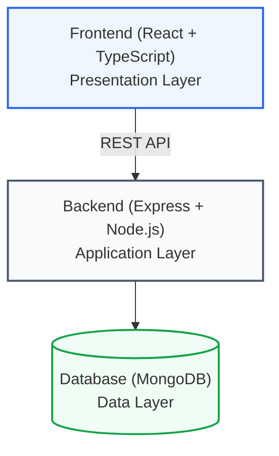

# 📚 EcoManage Documentation

Welcome to the comprehensive documentation for EcoManage! This directory contains detailed guides and references for developers, contributors, and deployers.

---

## 📖 Quick Navigation

### Getting Started
- **[README.md](../README.md)** — Project overview and quick start guide
- **[CONTRIBUTING.md](./CONTRIBUTING.md)** — How to contribute to the project

### Architecture & Design
- **[ARCHITECTURE.md](./ARCHITECTURE.md)** — System design, layers, and data flow
- **[TECH_STACK.md](./TECH_STACK.md)** — Technology choices and justification
- **[DATABASE.md](./DATABASE.md)** — MongoDB schema and data models

### API & Integration
- **[API_REFERENCE.md](./API_REFERENCE.md)** — Complete REST API endpoint documentation

### Testing
- **[TESTING.md](./TESTING.md)** — Comprehensive testing guide
- **[TEST_COVERAGE.md](./TEST_COVERAGE.md)** — Test coverage metrics and reports

### Deployment & Operations
- **[DEPLOYMENT.md](./DEPLOYMENT.md)** — Production deployment guide
- **[TROUBLESHOOTING.md](./TROUBLESHOOTING.md)** — Common issues and solutions

---

## 📋 Documentation by Role

### 👨‍💻 Frontend Developer
1. Start with [ARCHITECTURE.md](./ARCHITECTURE.md) → Frontend section
2. Read [TECH_STACK.md](./TECH_STACK.md) for frontend technologies
3. Check [API_REFERENCE.md](./API_REFERENCE.md) for API endpoints
4. Use [TESTING.md](./TESTING.md) for testing guidelines
5. Reference [TROUBLESHOOTING.md](./TROUBLESHOOTING.md) for issues

### 🔧 Backend Developer
1. Start with [ARCHITECTURE.md](./ARCHITECTURE.md) → Backend section
2. Read [DATABASE.md](./DATABASE.md) for data schema
3. Study [API_REFERENCE.md](./API_REFERENCE.md) for endpoint design
4. Use [TESTING.md](./TESTING.md) for test patterns
5. Reference [DEPLOYMENT.md](./DEPLOYMENT.md) for production

### 🧪 QA / Test Engineer
1. Read [TESTING.md](./TESTING.md) for testing strategy
2. Check [TEST_COVERAGE.md](./TEST_COVERAGE.md) for current coverage
3. Use [API_REFERENCE.md](./API_REFERENCE.md) for API testing
4. Reference [TROUBLESHOOTING.md](./TROUBLESHOOTING.md) for debugging
5. Follow [CONTRIBUTING.md](./CONTRIBUTING.md) for PR requirements

### 🚀 DevOps / Deployment
1. Read [DEPLOYMENT.md](./DEPLOYMENT.md) for setup
2. Review [ARCHITECTURE.md](./ARCHITECTURE.md) for system overview
3. Check [TROUBLESHOOTING.md](./TROUBLESHOOTING.md) for issues
4. Use [DATABASE.md](./DATABASE.md) for backup/recovery

### 📊 Project Manager
1. Review [ARCHITECTURE.md](./ARCHITECTURE.md) overview
2. Check [TEST_COVERAGE.md](./TEST_COVERAGE.md) for quality metrics
3. Read [DEPLOYMENT.md](./DEPLOYMENT.md) for release process
4. Reference [TECH_STACK.md](./TECH_STACK.md) for technology overview

### 🤝 Contributor
1. Start with [CONTRIBUTING.md](./CONTRIBUTING.md)
2. Read [ARCHITECTURE.md](./ARCHITECTURE.md) for system design
3. Use [TESTING.md](./TESTING.md) for test requirements
4. Follow guidelines in [CONTRIBUTING.md](./CONTRIBUTING.md)
5. Reference other docs as needed

---

## 🗺️ Documentation Structure

```
docs/
├── README.md                    # This file
├── ARCHITECTURE.md              # System design & components
├── TECH_STACK.md               # Technology choices
├── DATABASE.md                 # MongoDB schema
├── API_REFERENCE.md            # REST API endpoints
├── TESTING.md                  # Testing guide
├── TEST_COVERAGE.md            # Coverage metrics
├── DEPLOYMENT.md               # Production setup
├── TROUBLESHOOTING.md          # Common issues
└── CONTRIBUTING.md             # Contributing guide
```

---

## 🎯 Key Concepts

### System Layers



### Technology Highlights

- **Frontend**: React 18 + TypeScript + Tailwind CSS
- **Backend**: Express.js + Mongoose + JWT
- **Database**: MongoDB with Mongoose ODM
- **Testing**: Playwright E2E + Jest Unit + Vitest
- **DevOps**: Docker + Docker Compose

### Test Coverage

- **361 tests total** (100% passing)
- **295 backend tests** (90%+ coverage)
- **66 frontend tests** (85%+ coverage)
- **42 E2E tests** (14 × 3 browsers)

---

## ⚡ Quick Commands

### Development
```bash
# Start all services
docker compose up

# Install dependencies
npm install (in client, server, e2e)

# Run development servers
npm run dev (in client and server)
```

### Testing
```bash
# Backend tests
cd server && npm test

# Frontend tests
cd client && npm test

# E2E tests
cd e2e && npm test
```

### Building & Deployment
```bash
# Build frontend
cd client && npm run build

# Build backend
cd server && npm run build

# Build Docker images
docker build -t ecomanage-client ./client
docker build -t ecomanage-server ./server
```

---

## 📚 Learning Path

### For New Developers (1 week)
1. **Day 1-2**: Read [README.md](../README.md) and [ARCHITECTURE.md](./ARCHITECTURE.md)
2. **Day 2-3**: Set up development environment using [DEPLOYMENT.md](./DEPLOYMENT.md) (dev section)
3. **Day 3-4**: Explore codebase following [ARCHITECTURE.md](./ARCHITECTURE.md)
4. **Day 4-5**: Run tests following [TESTING.md](./TESTING.md)
5. **Day 5**: Make a small contribution following [CONTRIBUTING.md](./CONTRIBUTING.md)

### For Existing Developers (onboarding)
1. **Review** [ARCHITECTURE.md](./ARCHITECTURE.md) for system overview
2. **Check** specific area documentation (Frontend/Backend)
3. **Reference** [API_REFERENCE.md](./API_REFERENCE.md) for APIs
4. **Use** [TROUBLESHOOTING.md](./TROUBLESHOOTING.md) as needed

---

## 🔍 Finding Information

### I want to...

**...understand the system architecture**
→ Read [ARCHITECTURE.md](./ARCHITECTURE.md)

**...add a new API endpoint**
→ Use [CONTRIBUTING.md](./CONTRIBUTING.md) + [API_REFERENCE.md](./API_REFERENCE.md)

**...deploy to production**
→ Follow [DEPLOYMENT.md](./DEPLOYMENT.md)

**...add a new feature**
→ Check [CONTRIBUTING.md](./CONTRIBUTING.md) + [TESTING.md](./TESTING.md)

**...write tests**
→ Read [TESTING.md](./TESTING.md) + [TEST_COVERAGE.md](./TEST_COVERAGE.md)

**...fix a bug**
→ Use [TROUBLESHOOTING.md](./TROUBLESHOOTING.md) + [ARCHITECTURE.md](./ARCHITECTURE.md)

**...understand the database**
→ Read [DATABASE.md](./DATABASE.md)

**...choose technologies**
→ Review [TECH_STACK.md](./TECH_STACK.md)

---

## 📞 Getting Help

### Documentation
1. **Search**: Use Ctrl+F to search all docs
2. **Read**: Start with relevant section in this README
3. **Reference**: Check specific docs for detailed info

### Issues & Support
1. **Check**: [TROUBLESHOOTING.md](./TROUBLESHOOTING.md) first
2. **Search**: GitHub Issues for similar problems
3. **Report**: Create new issue with details

### Contributing
- Follow [CONTRIBUTING.md](./CONTRIBUTING.md) for guidelines
- Ask questions in GitHub Discussions
- Contact maintainers for guidance

---

## 🔄 Documentation Updates

Documentation is kept up-to-date with code changes.

### Recent Updates (May 2026)
- ✅ Complete API reference documented
- ✅ Test coverage expanded to 361 tests
- ✅ Phase 7 E2E tests completed
- ✅ Deployment guides added
- ✅ Architecture documentation finalized

### Contributing to Docs
1. Find the relevant .md file
2. Make changes following [CONTRIBUTING.md](./CONTRIBUTING.md)
3. Test changes (if applicable)
4. Submit PR with description

---

## 📋 Documentation Checklist

For maintainers: ensure documentation covers:

- [ ] Architecture overview
- [ ] Technology justification
- [ ] Setup instructions
- [ ] API documentation
- [ ] Database schema
- [ ] Testing guidelines
- [ ] Deployment procedures
- [ ] Troubleshooting guide
- [ ] Contributing guidelines
- [ ] Examples and use cases

---

## 🎓 Resources

### External Documentation
- [React Documentation](https://react.dev)
- [Express.js Guide](https://expressjs.com)
- [MongoDB Manual](https://docs.mongodb.com/manual)
- [Playwright Documentation](https://playwright.dev)
- [TypeScript Handbook](https://www.typescriptlang.org/docs)

### Tools & IDEs
- [VS Code](https://code.visualstudio.com)
- [GitHub](https://github.com)
- [Docker Documentation](https://docs.docker.com)
- [MongoDB Compass](https://www.mongodb.com/products/compass)

---

## 📈 Documentation Statistics

| Category | Documents | Pages | Last Updated |
|----------|-----------|-------|--------------|
| Architecture | 3 | 25 | 2026-05-07 |
| API & Database | 2 | 30 | 2026-05-07 |
| Testing & QA | 2 | 35 | 2026-05-07 |
| Operations | 2 | 30 | 2026-05-07 |
| Contributing | 1 | 15 | 2026-05-07 |
| **Total** | **10** | **135** | **2026-05-07** |

---

## 🚀 Quick Start

### New to EcoManage?

1. **Read** the [main README.md](../README.md)
2. **Review** [ARCHITECTURE.md](./ARCHITECTURE.md)
3. **Setup** development environment
4. **Run** tests to verify setup
5. **Explore** codebase following architecture
6. **Read** [CONTRIBUTING.md](./CONTRIBUTING.md)
7. **Make** your first contribution!

---

## ✅ Version Information

- **Project Version**: 1.0.0
- **Documentation Version**: 1.0.0
- **Last Updated**: 2026-05-07
- **Status**: Production Ready

---

<div align="center">

**🎉 Thank you for reading the EcoManage documentation!**

For questions, issues, or suggestions, please visit our [GitHub repository](https://github.com/e-choness/EcoManage).

[⬆ Back to Top](#-ecomanage-documentation)

</div>
