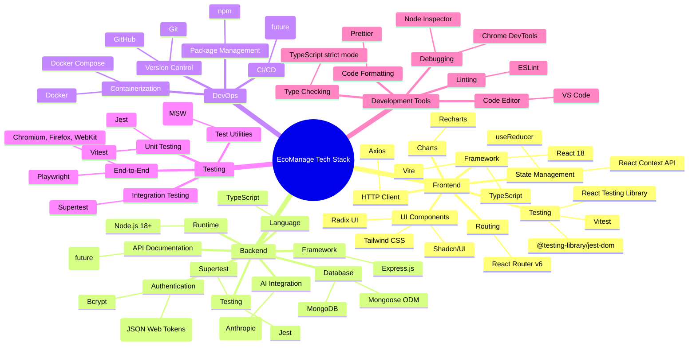
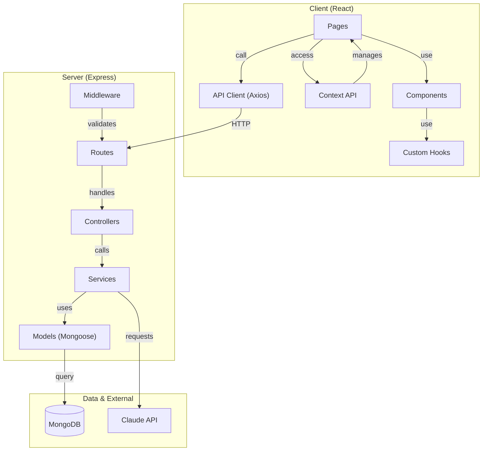

# 🛠️ Tech Stack

## Overview

EcoManage uses a modern, production-ready tech stack optimized for performance, scalability, and developer experience.

---

## Tech Stack Mindmap



---

## Detailed Technology Breakdown

### Frontend Stack

#### Framework & Language
- **React 18**: UI library with hooks and concurrent features
- **TypeScript**: Type-safe JavaScript for better IDE support and error catching
- **Vite**: Lightning-fast build tool and dev server

#### UI Components & Styling
- **Shadcn/UI**: Accessible, customizable React components
- **Radix UI**: Low-level UI component library (basis of Shadcn)
- **Tailwind CSS**: Utility-first CSS framework
- **Lucide React**: Beautiful SVG icons

#### State Management
- **React Context API**: Global state (authentication)
- **useReducer**: Complex state logic
- **Custom Hooks**: Reusable logic encapsulation

#### HTTP & API
- **Axios**: Promise-based HTTP client
- **Mock Service Worker (MSW)**: API mocking for tests

#### Data Visualization
- **Recharts**: React components for charts
- **D3.js** (future): Advanced visualizations

#### Routing
- **React Router v6**: Client-side routing and navigation

#### Testing
- **Vitest**: Fast unit test framework
- **React Testing Library**: Testing utilities for React
- **@testing-library/jest-dom**: DOM matchers

---

### Backend Stack

#### Runtime & Framework
- **Node.js 18+**: JavaScript runtime
- **Express.js**: Web framework
- **TypeScript**: Type safety

#### Database
- **MongoDB**: NoSQL document database
- **Mongoose**: MongoDB Object Modeling
  - Schema validation
  - Query building
  - Middleware support
  - Population/references

#### Authentication & Security
- **JWT (JSON Web Tokens)**:
  - Access token (15 min expiry)
  - Refresh token (7 day expiry)
- **Bcrypt**: Password hashing with salt rounds
- **cors**: CORS middleware
- **helmet**: Security headers
- **express-validator**: Input validation

#### AI Integration
- **Claude API** (Anthropic):
  - LLM insights generation
  - Data analysis
  - Recommendations

#### Utilities
- **dotenv**: Environment variable management
- **date-fns**: Date formatting and manipulation
- **lodash**: Utility functions

#### Testing
- **Jest**: Unit and integration testing
- **Supertest**: HTTP assertions
- **MongoDB Memory Server**: In-memory database for tests

---

### DevOps & Infrastructure

#### Containerization
- **Docker**: Container platform
- **Docker Compose**: Multi-container orchestration
  - Development: 4 services (client, server, mongodb, mongo-seed)
  - Production: Scalable configuration

#### Version Control
- **Git**: Distributed version control
- **GitHub**: Repository hosting

#### Package Management
- **npm**: JavaScript package manager
- **npm workspaces** (future): Monorepo support

#### CI/CD (Planned)
- **GitHub Actions**: Automated testing and deployment
  - Run tests on PR
  - Build images
  - Deploy to staging/production

---

### Testing Infrastructure

#### E2E Testing
- **Playwright 1.49.0+**:
  - Multi-browser testing (Chromium, Firefox, WebKit)
  - Headless mode
  - Screenshot on failure
  - Trace recording
  - HTML reporting

#### Unit Testing
- **Jest**: Test runner and assertion library
- **Vitest**: Faster alternative for frontend

#### Integration Testing
- **Supertest**: HTTP assertions for API
- **MongoDB Memory Server**: Isolated test database

#### Mocking
- **Mock Service Worker (MSW)**: API mocking
- **Jest Mock/Spy**: Function mocking

---

### Development Tools

#### Code Editor
- **VS Code**: Recommended IDE
  - Extensions:
    - ESLint
    - Prettier
    - Thunder Client (API testing)
    - MongoDB for VS Code

#### Linting & Formatting
- **ESLint**: Code quality and style
- **Prettier**: Code formatter
- **TypeScript**: Type checking

#### Debugging
- **Chrome DevTools**: Frontend debugging
- **Node Inspector**: Backend debugging
- **Playwright Inspector**: E2E test debugging

#### Productivity
- **Git Bash**: Unix-like shell on Windows
- **Postman**: API testing (optional)
- **MongoDB Compass**: Database GUI (optional)

---

## Version Information

### Node.js & npm
```bash
Node.js: 18.x or higher (recommended 20.x)
npm: 9.x or higher
```

### Core Dependencies

#### Frontend
```json
{
  "react": "^18.2.0",
  "typescript": "^5.2.0",
  "vite": "^5.0.0",
  "axios": "^1.6.0",
  "react-router-dom": "^6.20.0",
  "recharts": "^2.10.0",
  "@radix-ui/*": "latest",
  "tailwindcss": "^3.4.0",
  "lucide-react": "^0.294.0"
}
```

#### Backend
```json
{
  "express": "^4.18.0",
  "typescript": "^5.2.0",
  "mongoose": "^8.0.0",
  "bcryptjs": "^2.4.3",
  "jsonwebtoken": "^9.1.0",
  "cors": "^2.8.5",
  "dotenv": "^16.3.0"
}
```

#### Testing
```json
{
  "@playwright/test": "^1.49.0",
  "jest": "^29.7.0",
  "vitest": "^1.0.0",
  "@testing-library/react": "^14.1.0",
  "@testing-library/jest-dom": "^6.1.5",
  "msw": "^2.0.0"
}
```

---

## Architecture Diagram



---

## Why These Technologies?

### React + TypeScript
✅ Large ecosystem
✅ Reusable components
✅ Type safety with TypeScript
✅ Excellent tooling and IDE support
✅ Huge community and resources

### Tailwind CSS
✅ Utility-first approach
✅ Fast development
✅ Small production bundle
✅ Highly customizable
✅ Great documentation

### Mongoose
✅ Schema validation
✅ Middleware support
✅ Query building
✅ Relationship management
✅ Timestamps and soft deletes

### Express.js
✅ Lightweight and flexible
✅ Large middleware ecosystem
✅ Excellent for REST APIs
✅ Easy to test
✅ Great community support

### Playwright
✅ Multi-browser testing
✅ No flakiness (auto-waiting)
✅ Great debugging tools
✅ Fast execution
✅ Excellent reporting

### Docker
✅ Reproducible environments
✅ Easy deployment
✅ Service orchestration
✅ Isolation and security
✅ Industry standard

---

## Performance Characteristics

### Frontend
- **First Contentful Paint (FCP)**: <1s
- **Largest Contentful Paint (LCP)**: <2.5s
- **Cumulative Layout Shift (CLS)**: <0.1
- **Bundle Size**: ~500KB (gzipped)
- **Time to Interactive**: <3s

### Backend
- **API Response Time**: <200ms (p95)
- **Database Query**: <100ms (p95)
- **Memory Usage**: ~100MB per instance
- **CPU**: Low utilization with horizontal scaling

### Database
- **Query Time**: <50ms (indexed queries)
- **Connection Pool**: 10 concurrent connections
- **Replication**: Support for replica sets
- **Sharding**: Support for horizontal scaling

---

## Comparison with Alternatives

| Aspect | EcoManage | Vue.js | Angular | Django |
|--------|-----------|--------|---------|--------|
| Frontend Framework | React | Vue | Angular | N/A |
| Language | TypeScript | TypeScript | TypeScript | Python |
| Learning Curve | Medium | Easy | Steep | Medium |
| Bundle Size | ~500KB | ~400KB | ~1.2MB | N/A |
| Backend Framework | Express | N/A | N/A | Django |
| Database | MongoDB | Any | Any | Any |
| Testing | Playwright + Jest | Vitest + Playwright | Jasmine + Cypress | Django Test |
| Deployment | Docker/Kubernetes | Docker/Kubernetes | Docker/Kubernetes | Traditional |

---

## Future Technology Considerations

### Potential Additions
- **GraphQL**: Alternative to REST API
- **Redis**: Caching layer
- **Kafka**: Event streaming
- **Elasticsearch**: Full-text search
- **WebSockets**: Real-time updates
- **gRPC**: High-performance RPC

### Version Upgrades
- React 19+ (RSC, Suspense enhancements)
- Node 22+ (Latest features)
- MongoDB 8+ (Vector search, AI features)
- Playwright 2.0+ (Performance improvements)

---

## Security Technologies

### Authentication & Authorization
- **JWT**: Stateless authentication
- **Bcrypt**: Password hashing
- **HTTPS**: Encrypted transport
- **CORS**: Cross-origin control
- **Helmet**: Security headers

### Data Protection
- **Environment Variables**: Secret management
- **Mongoose Encryption**: Field-level encryption (future)
- **Database Backups**: Automated backups
- **Audit Logging**: Change tracking

---

## Monitoring & Observability

### Planned Tools
- **Prometheus**: Metrics collection
- **Grafana**: Metrics visualization
- **ELK Stack**: Centralized logging
- **Sentry**: Error tracking
- **New Relic**: Application monitoring

---

## Related Documents

- [Architecture Overview](./ARCHITECTURE.md)
- [Deployment Guide](./DEPLOYMENT.md)
- [Contributing Guide](./CONTRIBUTING.md)

---

[⬆ Back to Top](#-tech-stack)
