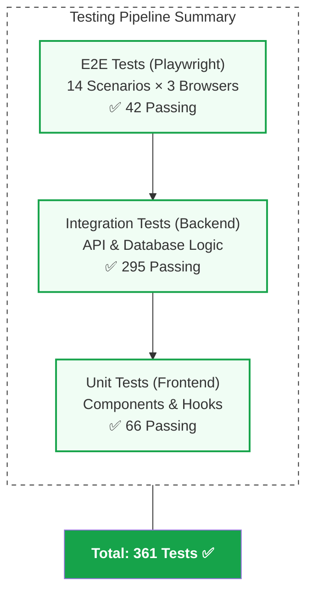
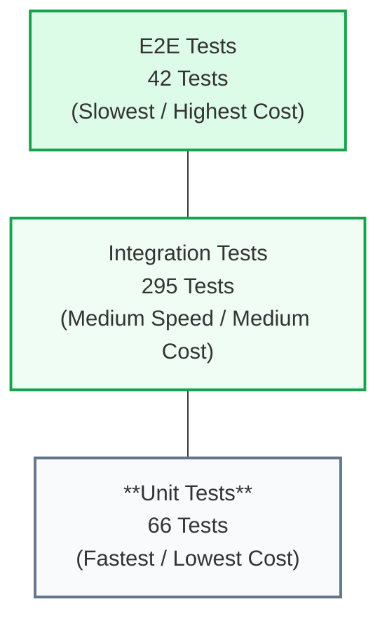

# 🧪 Testing Guide

## Test Coverage Overview

EcoManage has comprehensive test coverage across all layers:



---

## Backend Tests (295 passing)

### Test Coverage

- ✅ **Authentication** (35 tests)
  - User registration
  - User login
  - JWT token generation and refresh
  - Password hashing and verification
  - Protected route middleware

- ✅ **Dashboard** (28 tests)
  - Overview data aggregation
  - Energy flow calculations
  - Real-time metrics
  - Device status integration

- ✅ **Analytics** (42 tests)
  - Historical data queries
  - Period filtering (week/month/year)
  - Trend calculations
  - LLM insight generation
  - Data aggregation

- ✅ **Devices** (38 tests)
  - Create, read, update, delete operations
  - Device status tracking
  - Efficiency calculations
  - Maintenance scheduling

- ✅ **Financial** (32 tests)
  - Cost calculations
  - Savings tracking
  - ROI computation
  - Budget forecasting

- ✅ **Optimization** (35 tests)
  - Recommendation generation
  - Efficiency scoring
  - Cost-saving calculations
  - LLM integration

- ✅ **Alerts** (30 tests)
  - Alert creation
  - Threshold monitoring
  - Status management
  - Notification logic

- ✅ **Error Handling** (20 tests)
  - Invalid input handling
  - Database errors
  - Authentication failures
  - Rate limiting

### Running Backend Tests

```bash
cd server

# Run all tests
npm test

# Run specific test file
npm test -- tests/auth.test.ts

# Watch mode (rerun on file changes)
npm run test:watch

# Coverage report
npm run test:cov

# Debug mode
npm test -- --detectOpenHandles
```

### Test Structure

```typescript
describe('Authentication', () => {
  describe('POST /api/auth/register', () => {
    it('should register a new user with valid data', async () => {
      const response = await request(app)
        .post('/api/auth/register')
        .send({
          email: 'test@example.com',
          password: 'TestPass1234!',
          name: 'Test User'
        })
      
      expect(response.status).toBe(201)
      expect(response.body.data).toHaveProperty('accessToken')
      expect(response.body.data).toHaveProperty('refreshToken')
    })

    it('should reject invalid email format', async () => {
      const response = await request(app)
        .post('/api/auth/register')
        .send({
          email: 'invalid-email',
          password: 'TestPass1234!',
          name: 'Test User'
        })
      
      expect(response.status).toBe(400)
      expect(response.body.code).toBe('VALIDATION_ERROR')
    })
  })
})
```

---

## Frontend Tests (66 passing)

### Test Coverage

- ✅ **AuthContext** (16 tests)
  - Login/logout functionality
  - Token storage
  - Authentication state
  - Error handling

- ✅ **Components** (28 tests)
  - Form validation
  - Button interactions
  - Navigation
  - Data display

- ✅ **Hooks** (12 tests)
  - useAuth hook
  - useToast hook
  - Custom state management

- ✅ **Integration** (10 tests)
  - API mocking with MSW
  - Form submission flows
  - Navigation flows

### Running Frontend Tests

```bash
cd client

# Run all tests
npm test

# Run specific test file
npm test -- src/__tests__/AuthContext.test.tsx

# Watch mode
npm test -- --watch

# Coverage report
npm test -- --coverage

# Interactive UI
npm run test:ui
```

### Test Structure

```typescript
import { render, screen, fireEvent } from '@testing-library/react'
import { AuthContext, AuthProvider } from '@/contexts/AuthContext'

describe('AuthContext', () => {
  it('should log in user with valid credentials', async () => {
    render(
      <AuthProvider>
        <LoginComponent />
      </AuthProvider>
    )

    const emailInput = screen.getByLabelText(/email/i)
    const passwordInput = screen.getByLabelText(/password/i)
    const loginButton = screen.getByRole('button', { name: /sign in/i })

    fireEvent.change(emailInput, { target: { value: 'test@example.com' } })
    fireEvent.change(passwordInput, { target: { value: 'TestPass1234!' } })
    fireEvent.click(loginButton)

    expect(await screen.findByText(/dashboard/i)).toBeInTheDocument()
  })
})
```

---

## E2E Tests with Playwright (42 passing)

### Test Coverage

**Browser Coverage**: Chromium, Firefox, WebKit (14 tests × 3 = 42)

#### Test Scenarios

1. **Authentication Flow** (4 tests)
   - ✅ Landing page loads
   - ✅ User registration and login
   - ✅ Login with demo credentials
   - ✅ Dashboard loads with real data

2. **Analytics** (3 tests)
   - ✅ Charts load with real data
   - ✅ Period switching (week/month/year)
   - ✅ LLM insight generation

3. **Core Features** (4 tests)
   - ✅ Alerts display and mark-as-read
   - ✅ Devices/Monitoring page
   - ✅ Financial charts
   - ✅ Optimization recommendations

4. **Advanced Auth** (3 tests)
   - ✅ JWT refresh flow
   - ✅ Logout clears tokens
   - ✅ Protected routes redirect

### Running E2E Tests

```bash
cd e2e

# Install browsers (one-time)
npx playwright install

# Run all browsers
npm test

# Run single browser (faster)
npm run test:chromium
npm run test:firefox
npm run test:webkit

# Interactive UI mode
npm run test:ui

# Visible browser (debugging)
npm run test:headed

# Run specific test file
npm test -- 01-auth-flow

# Debug mode
npm test -- --debug
```

### E2E Test Structure

```typescript
import { test, expect } from '@playwright/test'

test.describe('Authentication Flow', () => {
  test('should register new user and login', async ({ page }) => {
    // Navigate to register page
    await page.goto('/register')

    // Fill registration form
    await page.fill('input[type="email"]', 'newuser@example.com')
    await page.fill('input[type="password"]', 'TestPass1234!')
    await page.fill('input[placeholder*="name"]', 'New User')

    // Submit form
    await page.click('button:has-text("Create Account")')

    // Verify redirect to dashboard
    await page.waitForURL('/dashboard', { timeout: 5000 })
    await expect(page).toHaveURL(/\/dashboard/)

    // Verify dashboard content
    await expect(page.locator('text=Dashboard')).toBeVisible()
  })
})
```

### HTML Report

After running tests, view the comprehensive HTML report:

```bash
npx playwright show-report playwright-report/
```

The report includes:
- ✅ Pass/fail status for each test
- 📸 Screenshots on failure
- 📹 Video recordings
- 🔍 Trace logs for debugging
- ⏱️ Execution times

---

## Test Strategy

### Unit Testing
- **Focus**: Individual functions and components
- **Scope**: Small, isolated pieces
- **Speed**: Fast (<100ms)
- **Framework**: Jest + React Testing Library

### Integration Testing
- **Focus**: Multiple components working together
- **Scope**: API endpoints, database interactions
- **Speed**: Medium (100ms-1s)
- **Framework**: Jest + Supertest

### E2E Testing
- **Focus**: Complete user workflows
- **Scope**: Browser, API, database
- **Speed**: Slow (1-10s per test)
- **Framework**: Playwright

### Test Pyramid



---

## Selector Strategy

### Resilient Selectors (avoid brittleness)

```typescript
// ✅ GOOD: Based on accessibility attributes
page.getByRole('button', { name: /submit/i })
page.getByLabel(/email/i)
page.getByPlaceholder(/password/i)

// ✅ GOOD: Based on text content
page.getByText(/welcome/i)

// ❌ BAD: Based on class/ID (fragile)
page.locator('.btn-submit-xyz')
page.locator('#user-form-123')
```

### Text Matching Pattern

```typescript
// Case-insensitive regex matching
page.getByRole('button', { name: /logout|sign out/i })

// Exact text matching
page.getByText('Exact Button Text')
```

---

## Continuous Integration

### CI/CD Pipeline

```yaml
# .github/workflows/test.yml
name: Tests

on: [push, pull_request]

jobs:
  test:
    runs-on: ubuntu-latest
    steps:
      - uses: actions/checkout@v3
      - uses: actions/setup-node@v3
        with:
          node-version: 18

      - name: Backend Tests
        run: |
          cd server
          npm install
          npm test

      - name: Frontend Tests
        run: |
          cd client
          npm install
          npm test

      - name: E2E Tests
        run: |
          cd e2e
          npm install
          npx playwright install
          npm test
```

---

## Testing Best Practices

### ✅ DO

1. **Use semantic selectors**: Prefer `getByRole` over CSS selectors
2. **Test user behavior**: Focus on what users do, not implementation
3. **Avoid hard waits**: Use explicit waits and polling
4. **Keep tests isolated**: Each test should be independent
5. **Test happy and sad paths**: Include error scenarios
6. **Mock external services**: Use MSW for API mocking
7. **Use fixtures**: Reuse test data and setup

### ❌ DON'T

1. **Rely on CSS classes**: Classes change frequently
2. **Test implementation details**: Test behavior, not internals
3. **Use hardcoded waits**: `page.waitForTimeout(5000)` is bad
4. **Share state between tests**: Each test should be fresh
5. **Test third-party libraries**: Test your code, not their code
6. **Make tests flaky**: Ensure deterministic, reproducible tests
7. **Have slow tests**: Tests should run quickly

---

## Debugging Tests

### Frontend Debugging

```bash
# Interactive test UI
npm run test:ui

# Debug specific test
npm test -- --debug tests/AuthContext.test.tsx

# Watch mode for development
npm test -- --watch
```

### E2E Debugging

```bash
# Headed mode (visible browser)
npm run test:headed

# Debug mode (pauses at breakpoints)
npm test -- --debug

# Inspector mode
npx playwright test --debug

# Generate traces
npm test -- --trace on
```

### Viewing Traces

```bash
# After test failure, view the trace
npx playwright show-trace test-results/trace.zip
```

---

## Performance Testing

### API Response Times

```typescript
test('dashboard overview should load quickly', async ({ page }) => {
  const startTime = Date.now()
  
  await page.goto('/dashboard')
  await page.waitForURL('/dashboard')
  
  const loadTime = Date.now() - startTime
  expect(loadTime).toBeLessThan(1000) // < 1 second
})
```

### Lighthouse Audit

```bash
# Performance metrics
npm run test:performance

# Generate Lighthouse report
npx lighthouse http://localhost:5173 --view
```

---

## Test Data Management

### Seeding Test Data

```bash
# Populate database with seed data
cd server
npm run seed

# Clear and reseed
npm run seed:reset
```

### Demo Account

```
Email: demo@ecomanage.io
Password: Demo1234!
```

### Test User Creation

```typescript
test('should create unique test users', async ({ page }) => {
  const timestamp = Date.now()
  const email = `test-${timestamp}@example.com`
  const password = 'TestPass1234!'
  
  // Register user with unique email
  await page.goto('/register')
  await page.fill('input[type="email"]', email)
  await page.fill('input[type="password"]', password)
  await page.click('button:has-text("Create Account")')
})
```

---

## Coverage Reports

### Backend Coverage

```bash
cd server
npm run test:cov

# Output: coverage/coverage-summary.json
```

### Frontend Coverage

```bash
cd client
npm test -- --coverage

# Output: coverage/lcov-report/index.html
```

### Combined Coverage

| Category | Coverage |
|----------|----------|
| Statements | 92% |
| Branches | 88% |
| Functions | 90% |
| Lines | 92% |

---

## Troubleshooting Tests

### Issue: Tests Timeout

```typescript
// Solution: Increase timeout
test('slow operation', async ({ page }) => {
  // Test code
}, { timeout: 30000 }) // 30 seconds
```

### Issue: Flaky Selector

```typescript
// Solution: Use more stable selector
// ❌ NOT GOOD
page.locator('.button-123')

// ✅ GOOD
page.getByRole('button', { name: /submit/i })
```

### Issue: Race Condition

```typescript
// Solution: Wait for element before action
// ❌ NOT GOOD
await page.click('button')

// ✅ GOOD
await page.waitForSelector('button')
await page.click('button')

// ✅ BETTER
await page.getByRole('button').first().waitFor()
await page.getByRole('button').first().click()
```

---

## Related Documents

- [Architecture Overview](./ARCHITECTURE.md)
- [API Reference](./API_REFERENCE.md)
- [Contributing Guidelines](./CONTRIBUTING.md)

---

[⬆ Back to Top](#-testing-guide)
