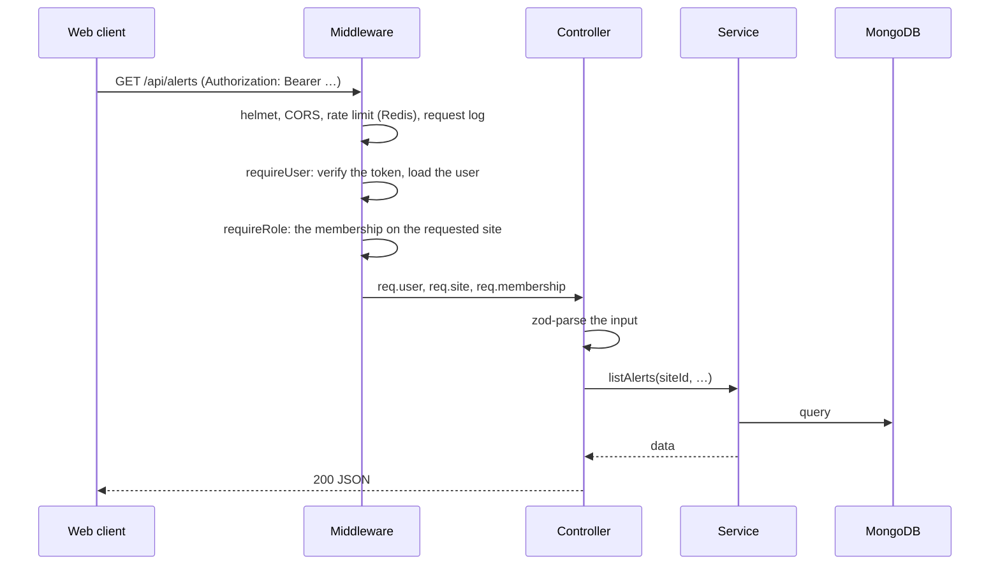
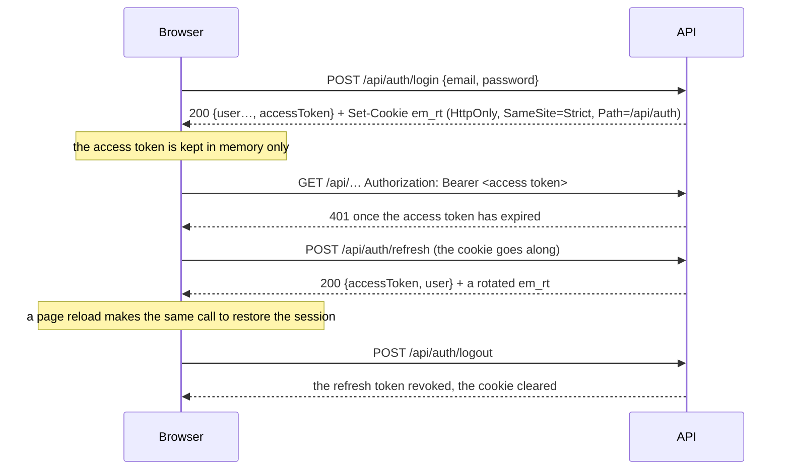

# API

`apps/api`: the REST API, the live stream, sign-in, roles, approvals, gateway claims and
explanations. Every endpoint is in the [REST API reference](../reference/api.md).

## Layout

```text
src/
  server.ts          env check, Redis, MongoDB, the MQTT link, listen
  app.ts             createApp(): middleware and every module's routes (the tests use it too)
  config/            env.ts (zod-checked), logger.ts (pino, with redaction), database.ts
  middleware/        auth.ts (requireUser), roles.ts (requireRole), security.ts (CORS, helmet, rate limits, request log)
  lib/               http.ts (handle, HttpError, zod parse), gatewayLink.ts (MQTT), jobs.ts (queues),
                     siteEvents.ts (Redis events), secrets.ts (sealing keys)
  modules/<name>/    routes.ts → controller.ts → service.ts
  scripts/           seed, migrate, gateway:register
```

Modules: `auth`, `invites`, `people`, `site` (settings, snapshot, stream, model, today, gateway,
explanations), `devices`, `alerts`, `recommendations`, `commands`, `inbox`, `audit`, `tariffs`,
`bills`, `calendar`, `notifications`, `forecast`, `history`, `exports`, `reports`, `rules`,
`models` (3D uploads), `gateway` (claims and certificate signing) and `health`.

## Layers

- **routes.ts** only wires middleware (`requireUser`, `requireRole(...)`) to controller functions.
- **controller.ts** parses `req.body` and `req.query` with zod, calls one service function and
  shapes the response. Each handler is wrapped in `handle(fallback, fn)`: a thrown `HttpError`
  becomes its status and body; anything else is logged and answered with the route's fallback.
- **service.ts** holds the logic: plain values in, data or `null` out, no Express types.
- **Models** live in `@ecomanage/db`, shared with the other services.
- **Audit:** every service function that writes site data calls `recordAudit` with the values
  before and after. `audit.test.ts` lists every write route with its action (or why it has none),
  so a new write route fails the tests until it's audited.



## Sign-in and sessions



- Access tokens last a day and refresh tokens 30 days. The user document stores the current
  refresh token, so an older (rotated) one is refused.
- Several requests failing with 401 at once share one refresh call in the web client.
- **Roles:** `requireRole` finds the caller's membership on the site named in the `X-Site-Id`
  header, or their oldest active membership. Expired memberships count as none.

## Errors

- Most endpoints answer errors as `{ "error": { "code", "message", "details"? } }`: `400` with
  `details.issues` for invalid input, `403` for the wrong role, `404`, `409` for a state conflict,
  `422` for a rule the input breaks, `429` for rate limits, `503` when a dependency (Redis, the
  broker, the worker queue) is missing.
- The `auth` endpoints answer `{ "message": "…" }`, and the token check answers
  `401 {"message":"Unauthorized"}` without a token or `401 {"error":"Invalid or expired token"}`
  with a bad one.
- Unhandled errors are logged and answered `500 { error: { code: 500, message } }`.

## The live stream

`GET /api/site/stream` is server-sent events, authenticated with the bearer token (the browser
reads it with `fetch`, since `EventSource` can't send headers).

1. The API subscribes to `site:{siteId}:events` in Redis, builds the **snapshot** (devices with
   their latest readings, flows, battery, demand, the month's peak, the gateway) and sends it
   first. Events that arrive while it's being built are held and sent right after.
2. Then it forwards `telemetry` (at most one per device every 5 s), `demand`, `device`, `alert`
   and `command` events.
3. **Inbox:** the rules service and the API publish small `inbox` notes when a decision changes.
   The stream collects those, with every alert and command event, and sends one `inbox` event with
   fresh counts and the changed items at most every 300 ms, plus one right after the snapshot.
4. A `: heartbeat` comment every 20 s keeps proxies from closing it.

Any API instance can serve any stream, since everything comes through Redis.

## Talking to gateways

The API connects to the broker as `svc-api`. Its access list lets it write commands, jobs and
config, and read acks, job results, gateway status and claim requests.

- **Config:** when the battery floor changes, the API publishes the retained
  `site/{siteId}/config` message `{ ts, batteryFloorPct }`. A gateway gets it on every
  (re)subscribe and enforces it itself. If the broker can't be reached, the site is flagged
  `gatewayConfigPending` and the config is sent again on the next connect.
- **Jobs:** scan and commission are gateway jobs. The API subscribes to the job's result topic
  before publishing the job, then waits (20 s for a scan, 30 s for commissioning).
- **Claims:**
  - `gateway:register <serial>` stores the gateway with only a hash of its claim code and prints
    the code and QR text.
  - On first start the gateway makes an EC P-256 key and a certificate request, connects with the
    shared bootstrap certificate using its serial as the client id (the broker allows only
    `claim/%c/csr` out and `claim/%c/cert` in), and publishes `{ csr, proof, fw, ts }` every 30 s.
    `proof` is an HMAC of the request keyed by the claim key. The API keeps the latest request with
    a valid proof.
  - `POST /api/site/gateway/claim` binds the gateway to the site. The API signs the request with
    the broker's CA (`MQTT_CA_KEY`), with the site id as the certificate's CN, and sends it on
    `claim/{serial}/cert` with the CA certificate. The gateway checks it's for its own key, names
    the site and is signed by that CA, then reconnects with it; the broker's `site/%u/#` pattern
    keeps it to that site.
  - Signing uses the code up. The same request asking again (a lost answer) gets the same
    certificate; a new key doesn't.

## Explanations

`modules/recommendations/explain.ts` and `llm.ts`:

- **Which model:** the site's own, if its owner added one; else the server's default (`LLM_*` or
  `ANTHROPIC_API_KEY`); else off. Any OpenAI-compatible API (`POST {baseUrl}/chat/completions`
  with a bearer key) or Anthropic through its SDK. The site's key is sealed with AES-256-GCM under
  `SECRETS_KEY`, shown as its last four characters, never logged or audited. The base URL must be
  `https://` to a public host unless `LLM_ALLOW_PRIVATE_URLS` is on, and redirects aren't followed.
- **Input:** only the server's own proposal, rebuilt: the rule's fixed title, the device type, the
  action and its settings (numbers, booleans and times only), the window and time zone, the checks,
  the calculation and the expected saving. The request body, the title and inputs (they name
  devices, vehicles and people) and decline reasons are left out. Any text typed on the site that
  appears in a check or calculation (device and vehicle names, RFID tags, people's names and
  emails, the site's name and address) is replaced ("the EV charger", "a person"). The system
  prompt tells the model the JSON is data, not instructions.
- **The request:** at most 1,500 output tokens. On Anthropic, low effort with server-side
  fallbacks; on an OpenAI-compatible API, a plain chat completion where `content_filter` counts as
  declined. A refusal, an empty answer or an error comes back as `502` with the reason, never as
  an explanation.
- **Cache and budget:** the answer is stored on the recommendation with a SHA-256 of its input, so
  asking again is free until the proposal changes. `llmUsage` counts each site's tokens per month
  against its budget.

## Scripts

| Command | What it does |
| ------- | ------------ |
| `pnpm --filter @ecomanage/api seed` | Resets the demo accounts and site |
| `pnpm --filter @ecomanage/api migrate [-- --drop-legacy]` | Brings a database up to date; see [Operations](../deploy/operations.md#migrating-from-ecomanage-1) |
| `pnpm --filter @ecomanage/api gateway:register <serial> [--out factory.json]` | Registers a gateway |
| `pnpm --filter @ecomanage/api provision …` | Sites and access from a plan; see [Operations](../deploy/operations.md#sites-and-people-provisioning) |

## Provisioning

`modules/provisioning/` applies a plan (`plan.ts`, zod) of sites and members. `applyPlan()` works
out each site's changes first (a dry run of the whole plan, so one bad site changes nothing), then
makes them: sites by `externalId` or name, memberships for people with an account, invites
(`issueInvite()`, shared with Settings → People) for the rest. What it grants carries
`source: "provisioning"` on the membership or invite (an accepted invite passes it on), which is
what `prune` may remove and what a re-run may change; access with `source: "app"` is only ever
taken over when the plan lists that person. Every write is audited with `userId: null`.

It's a function rather than an endpoint on purpose: a directory or CRM connector (a scheduled
export, a SCIM bridge, a webhook) calls it with a plan, and sign-in stays independent of it, since
access is keyed on the email address and no password is involved.
