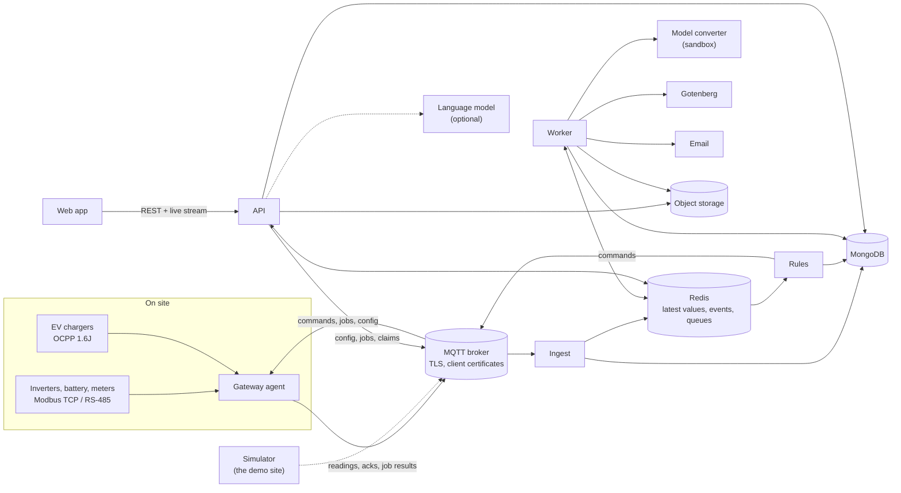

# Architecture

EcoManage is a handful of Node services around MongoDB, Redis and an MQTT broker. Devices on a site
talk to a **gateway**; the gateway talks to the cloud over MQTT; the services turn readings into
live views, intervals, bills, alerts and recommendations; the web app shows them and sends back
people's decisions.



## The services

| Service | Job | Page |
| ------- | --- | ---- |
| **api** | REST API, the live stream (server-sent events), sign-in and roles, approvals, gateway claims, explanations | [API](./api.md) |
| **web** | The single-page app | [Web app](./web.md) |
| **ingest** | Validates and stores every reading, tracks device and gateway status, builds 15-minute intervals, records command acks, publishes live events | [Ingest and intervals](./ingest.md) |
| **rules** | Opens and closes alerts, runs the recommendation rules every quarter hour, sends, verifies and reverts commands | [Rules](./rules.md) |
| **worker** | BullMQ jobs: pricing intervals, bills and savings, statements and utility bills, email, exports, reports, forecasts, 3D uploads | [Worker](./worker.md) |
| **simulator** | A simulated site that behaves exactly like a gateway | [Simulator](./simulator.md) |
| **gateway** | The agent on site (not a cloud service) | [Gateway agent](./gateway-agent.md) |
| **modelconv** | Converts 3D models in a sandbox | [3D model converter](./model-converter.md) |

The services share code through four packages, used as TypeScript source:

- **`@ecomanage/shared`:** types and zod schemas for everything that crosses a boundary (MQTT
  messages, API responses), the tariff, billing and savings maths, site-time helpers, the solar
  and weather models, the site model's building plan.
- **`@ecomanage/db`:** the Mongoose models, `initModels()` (collections and indexes), the audit
  helper, and the object store client.
- **`@ecomanage/profiles`:** device profiles (how to read and control each kind of device) and the
  gateway-side safety checks, shared by the simulator and the real gateway.
- **`@ecomanage/recs`:** the recommendation rules, their context and runner, shared by the rules
  service (proposing) and the API (checking again at approval).

## How data moves

### A reading, from device to screen

```mermaid
sequenceDiagram
    participant GW as Gateway / simulator
    participant B as Broker
    participant I as Ingest
    participant R as Redis
    participant A as API
    participant W as Browser
    GW->>B: site/{site}/dev/{dev}/telemetry (every 5 s)
    B->>I: as svc-ingest
    I->>I: validate against the schema and the device's profile, drop duplicates
    I->>R: SET latest:{dev}; PUBLISH site:{site}:events
    I->>I: batch into the telemetry time series
    W->>A: GET /api/site/stream (Bearer token)
    A->>W: event: snapshot
    R-->>A: telemetry / demand / device events
    A->>W: event: telemetry
```

The browser applies each event to its cached snapshot with the same shared functions the API uses
to build it, so the numbers agree. Through the dev server's proxy a reading reaches the browser
about two-thirds of a second after the device was read.

### A quarter hour, from readings to a bill

1. **Ingest** closes each 15-minute interval 30 seconds after it ends: energy per source and
   consumer from the devices' counters, demand from the meter, the building as the remainder.
2. **Worker**, every minute, prices new or changed intervals with the tariff version in force that
   day, then recomputes the bill of each billing period they touched.
3. Late readings mark their interval dirty; it's rebuilt, priced again and the bill follows.

### A recommendation, from rule to device

```mermaid
sequenceDiagram
    participant RU as Rules
    participant A as API
    participant P as Person
    participant B as Broker
    participant G as Gateway
    participant I as Ingest
    RU->>RU: every quarter hour: rules on live data, forecast, tariff
    RU->>A: (MongoDB) recommendation proposed; inbox event
    P->>A: approve (checks run again now)
    A->>A: command created, sendAt = window start
    RU->>B: at sendAt: site/{site}/cmd/{id}
    B->>G: command (with expiry and end)
    G->>G: safety checks from the profile
    G->>B: ack
    B->>I: ack → command acked
    RU->>RU: verify against newer readings (5 min)
    RU->>B: at the end: the revert command
```

## Principles

- **Nothing reaches a device without a person's approval**, and the checks run again at that
  moment. The rules service only proposes.
- **The gateway protects the site on its own:** limits from the profile, the battery floor, every
  command ending on time, everything undone after 15 minutes without the cloud.
- **Every write to a site is audited,** with before and after values; a test lists every write
  endpoint.
- **Money is whole cents; power kW, energy kWh; time is UTC in storage and the site's time zone on
  screen.** Billing periods, forecasts, report schedules and History buckets all follow the site's
  clock through daylight-saving changes.
- **Power sign convention:** positive into the switchboard (solar, battery discharge, grid import),
  negative out of it (loads, charging, export).
- **The same code runs in both places:** the tariff maths in the API, the worker and the browser;
  the safety checks in the simulator and the gateway; the rules in the rules service and the API.

## Tech stack

| Area | Choice |
| ---- | ------ |
| Runtime | Node 26, TypeScript 6 (strict), run with tsx |
| API | Express 5, Mongoose 9, zod 4, pino, helmet, express-rate-limit with Redis, jsonwebtoken, bcryptjs |
| Web | React 19, Vite 8, Tailwind 4, Radix (shadcn/ui), TanStack Query, three.js, react-router 7 |
| Background | BullMQ on Redis, MQTT.js, pdfkit, exceljs, unpdf, nodemailer |
| Data | MongoDB 8 (a time-series collection for readings, GridFS for files), Redis 8, S3-compatible object storage |
| Edge | modbus-serial, an OCPP 1.6J server on `ws`, `node:sqlite`, `@peculiar/x509` for certificates |
| 3D | glTF-Transform, meshoptimizer, Draco, the Khronos glTF validator, assimp, IfcOpenShell, KTX-Software |
| Tests | Vitest everywhere (supertest for the API, Testing Library and MSW for the web), Playwright with axe |
| Tooling | pnpm 12 workspace, ESLint 10, knip, Docker Compose, GitHub Actions, VitePress |
